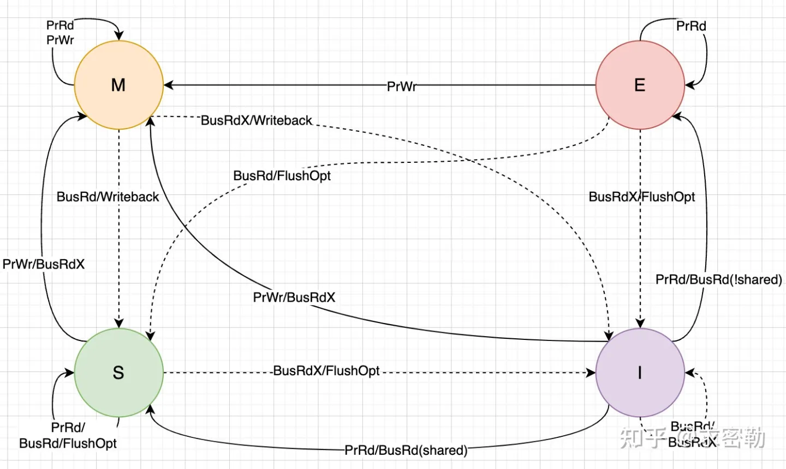

## MESI协议
MESI协议（Write-Once总线监听协议），MESI这四个字母分别代表Modify、Exclusive、Shared和Invalid。
Cache Line的状态必须是这四个中的一种。前三种状态均是数据有效下的状态。Cache Line有两个标志-脏（dirty）和有效（valid）。
脏代表该数据和内存不一致。只有干净的数据才能被多个Cache Line共享。

| 状态                | 说明                                                                                                                                        |
|-------------------|-------------------------------------------------------------------------------------------------------------------------------------------|
| M（Modified-修改）    | 数据已被修改，和内存的数据不一致（数据已经被更新过，但是还没有写到内存里），该数据只存在于此CPU对应的Cache Line中                                                                           |
| E（Exclusive-独占）   | 数据和内存中一致，该数据只存在于此CPU对应的Cache Line中，此时如果要向Cache Line写数据，就可以直接自由地写入，而不需要通知其他CPU，因为只有你这有这个数据，就不存在缓存一致性的问题了，于是就可以随便操作该数据                      |
| S（Shared-共享）      | 数据和内存中一致，多个CPU对应的Cache Line都持有这行数据的副本，此时如果要向Cache Line写数据，就不能直接修改。而是要先向所有的其他CPU广播一个请求，要求先把其他CPU的Cache Line标记为无效状态，然后再更新当前Cache Line里面的数据。 |
| I（Invalidated-失效） | 这行数据无效                                                                                                                                    |

MESI在总线上的操作分为**本地读写**和**总线操作**。
1. 当操作类型是**本地**读写时，Cache Line的状态指的是本地CPU；
2. 而当操作类型是总线读写时，Cache Line的状态指的是远端CPU。

| 操作类型   | 描述                                                                 |
| ---------- |--------------------------------------------------------------------|
| 本地读     | 本地CPU读取Cache Line                                                  |
| 本地写     | 本地CPU更新Cache Line                                                  |
| 总线读     | 总线监听一个来自其他cpu的读cache信号。收到信号的cpu先检查cache是否存在该数据，然后广播应答              |
| 总线写     | 总线监听一个来自其他cpu的写cache信号。收到信号的cpu先检查cache是否存在该数据，然后广播应答              |
| 总线更新   | 总线收到更新请求，请求其他cpu干活。其他cpu收到请求后，若cpu有cache副本，则使其Cache Line无效         |
| 刷新       | 总线监听到刷新请求，收到请求的cpu把自己的Cache Line内容写回主内存                            |
| 刷新到总线 | 收到该请求的cpu会将Cache Line内容发送到总线上，这也意味着发送这个请求的CPU就可以获取到这个Cache Line的内容 |

## 状态转换图

## MESI状态图转换详细解读

### 初始状态为I

#### 发起读操作
假设CPU0发起了本地读请求，CPU0发出读PrRd请求，因为是本地cache line是无效状态，所以会在总线上产生一个BusRd信号，然后广播到其他CPU。其他CPU会监听到该请求（BusRd信号的请求）并且检查它们的缓存来判断是否拥有了该副本。

对于初始状态为I的cache来说，有四种可能的状态图:

1. 如果CPU1,CPU2, CPU3上的cache line都没有缓存数据，状态都是I，那么CPU0会从内存中读取数据到L1 cache，把cache line状态设置为E。（全部为I）

2. 如果CPU1发现本地副本，并且这个cache line的状态为S，那么在总线上回复一个FlushOpt信号，即把当前的cache line的内容发送到总线上。
刚才发出PrRd请求的CPU0，就能得到这个cache line的数据，然后CPU0状态变成S。这个时候的cache line的变化情况是：CPU0上的cache line从I->S，
CPU1上的cache line保存S不变。(I->S)

3. 如果CPU2发现本地副本并且cache line的状态为E，则在总线上回应FlushOpt信号，把当前的cache line的内容发送到总线上，CPU2上的高速缓存行的状态变成S。
这个时候 cache line的变化情况：CPU0的cache line变化是I->S，而CPU2上的cache line从E变成了S。(I->E)

4. 如果CPU3发现本地副本并且cache line的状态为M，将数据更新到内存，这时候两个cache line的状态都为S。cache line的变化情况：
CPU0上cache line变化是I->S，CPU3上的cache line从M变成了S。(I->M)

#### 发起写操作
假设CPU0发起了本地写请求，即CPU0发出读PrWr请求：

由于CPU0的本地cache line是无效的，所以，CPU0发送BusRdX信号到总线上。这里的本地写操作，就变成了总线写操作，于是我们要看其他CPU的情况:
其他CPU（例如CPU1等）收到BusRdX信号，先检查自己的高速缓存中是否有缓存副本，广播应答信号。
1. 假设CPU1上有这份数据的副本，且状态为S，CPU1收到一个BusRdX信号指挥，会回复一个flushopt信号，把数据发送到总线上，把自己的cache line设置为无效，状态变成I，然后广播应答信号。

2. 假设CPU2上有这份数据的副本，且状态为E，CPU2收到这个BusRdx信号之后，会回复一个flushopt信号，把数据发送到总线上，把自己的cache line设置为无效，然后广播应答信号。

3. 若其他CPU上也没有这份数据的副本，也要广播一个应答信号。

CPU0会接收其他CPU的所有的应答信号，确认其他CPU上没有这个数据的缓存副本后。CPU0会从总线上或者从内存中读取这个数据：
a)如果其他CPU的状态是S或者E的时候，会把最新的数据通过flushopt信号发送到总线上。
b)如果总线上没有数据，那么直接从内存中读取数据。
最后才修改数据，并且CPU0本地cache line的状态变成M。

### 初始状态为M
对于M的本地读写操作均无效，因为M表示此cache line的数据是最新且dirty的。

#### 收到总线读操作
假设是CPU0的cache line的状态为M，而在其他CPU上没有这个数据的副本。当其他CPU（如CPU1）想读这份数据时，CPU1会发起一次总线读操作，所以，流程是这样的：

若CPU0上有这个数据的副本，那么CPU0收到信号后把cache line的内容发送到总线上，然后CPU1就获取这个cache line的内容。另外，CPU0会把相关内容发送到主内存中，把cache line的内容写入主内存中。这时候CPU0的状态从M->S
更改CPU1上的cache line状态为S。

#### 收到总线写操作
假设数据在本地CPU0上有副本并且状态为M，而其他CPU上没有这个数据的副本。若某个CPU（假设CPU1）想更新（写）这份数据，CPU1就会发起一个总线写操作。

若CPU0上有这个数据的副本，CPU0收到总线写信号后，把自己的cache line的内容发送到内存控制器，并把该cache line的内容写入主内存中。CPU0上的cache line状态变成I。
CPU1从总线或者内存中取回数据到本地cache line，然后修改自己本地cache line的内容。CPU1的状态变成M。

### 初始状态为S
当本地CPU的cache line状态为S时，

如果CPU发出本地读操作，S状态不变。

如果CPU收到总线读（BusRd），状态不变，回应一个FlushOpt信号，把数据发到总线上。
如果CPU发出本地写操作（PrWr）

发送BusRdX信号到总线上。
本地CPU修改本地高速缓存行的内容，状态变成M。
发送BusUpgr信号到总线上。
其他CPU收到BusUpgr信号后，检查自己的高速缓存中是否有副本，若有，将其状态改成I。

### 初始状态为E
当本地CPU的cache line状态为E的时候:

#### 本地读，
    从该cache line中取数据，状态不变。
#### 本地写，
    修改该cache line的数据，状态变成M。
#### 收到一个总线读信号，独占状态的cache line是干净的，因此状态变成S。
cache line的状态先变成S。
发送FlushOpt信号，把cache line的内容发送到总线上。
发出总线读信号的CPU，从总线上获取了数据，状态变成S。

#### 收到一个总线写，数据被修改，该cache line不再使用，状态变成I。
cache line的状态先变成I。
发送FlushOpt信号，把cache line的内容发送到总线上。
发出总线写信号的CPU，从总线上获取了数据，然后修改，状态变成M。
