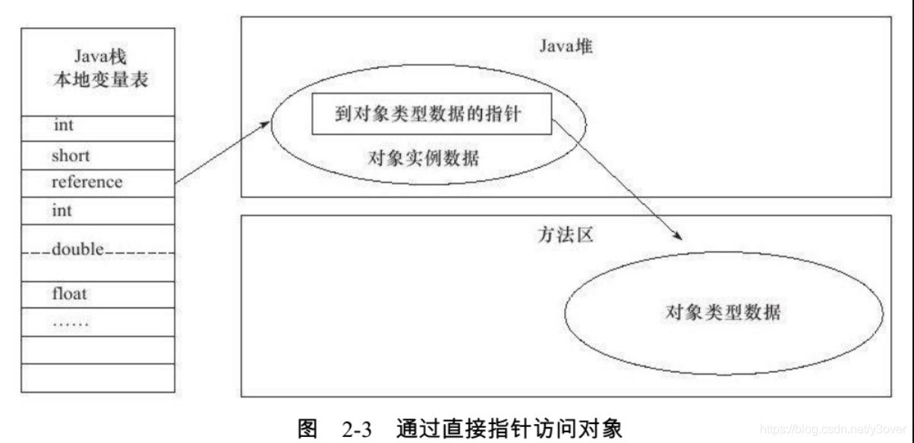
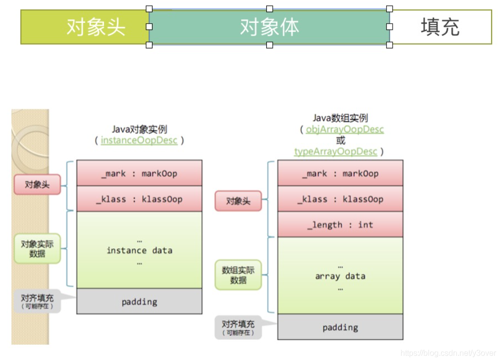
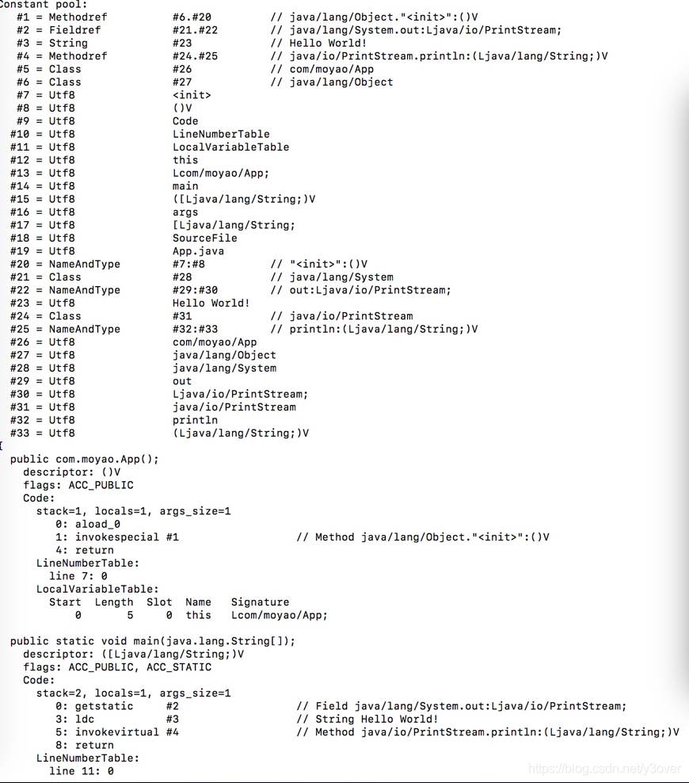
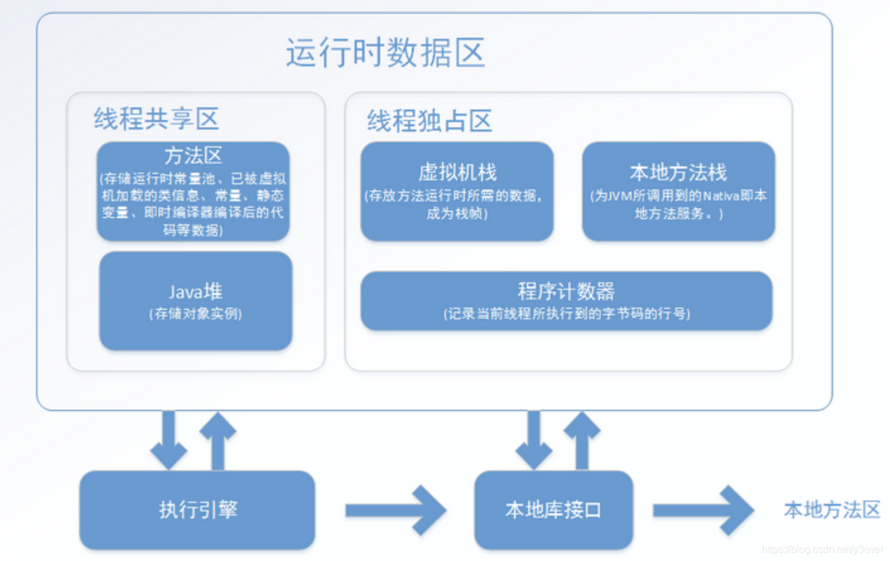

## openjdk目录说明

openjdk源码中有很多目录，根据功能做了模块化划分，每个目录实现其相应的功能。
每个目录下的结构都差不多，分为src(源码)、make(makefile)、test(或没有)、其他特殊目录。

openjdk
│   common   一些公共文件，比如下载源码的shell脚本、生成make的autoconf等文件
│   corba     分布式通讯接口
└───hotspot  虚拟机实现
│   │   make 用来build出HotSpot的各种配置文件
│   │   test 单元测试文件
│   │   Agent  主要实现Serviceability Agent的客户端实现
│   └───src  源码目录
│       │   Cpu 处理器的代码，主要按照Sparc、x86和Zero三种计算机体系结构，（汇编器、模板解释器、ad文件、部分runtime函数在这里实现）
│       │   Os  操作系统的代码，主要按照Linux、Windows、Solaris和Posix2
│       │   Os_cpu 同时依赖于操作系统和处理器的代码，如Linux+Sparc、Linux+x86、Linux+Zero...等模块。
│       └───Share  独立于操作系统和处理器类型的代码，这部分代码是HotSpot工程的核心业务，实现了HotSpot的主要功能
│   │   │   │   Tools  独立的虚拟机工具程序，如Hsdis...
|   |   |   |   |__hsdis   反汇编插件
                |__IdealGraphVisualizer       将server编译器的中间代码可视化的工具
                |__launcher                   启动程序“java”
                |__LogCompilation             将-XX:+LogCompilation输出的日志（hotspot.log）整理成更容易阅读的格式的工具
                |__ProjectCreator             生成Visual Studio的project文件的工具
                
│   │   │   └───vm 实现虚拟机各项功能
│   │   │   │   │  Adlc：平台描述文件（上面的cpu或os_cpu里的*.ad文件）的编译器
│   │   │   │   │  Asm：汇编器。

│   │   │   │   │  C1：client编译器，即C1编译器。
│   │   │   │   │  Ci：动态编译器公共服务/从动态编译器到VM的接口
│   │   │   │   │  Classfile：Class文件解析和类的链接等。（包括类加载和系统符号表等）
│   │   │   │   │  Code：机器码生成。动态生成的代码的管理
│   │   │   │   │  Compiler：调用动态编译器的接口。
│   │   │   │   │  Gc_implementation：垃圾收集器的具体实现。
                    |__concurrentMarkSweep      Concurrent Mark Sweep GC的实现
                    |__g1                       Garbage-First GC的实现（不使用老的分代式GC框架）
                    |__parallelScavenge         ParallelScavenge GC的实现（server VM默认，不使用老的分代式GC框架）
                    |__parNew                   ParNew GC的实现
                    |__shared                   GC的共通实现
│   │   │   │   │  Gc_interface：GC接口。   
│   │   │   │   │  Interpreter：解释器。，包括“模板解释器”（官方版在用）和“C++解释器”（官方版不在用）
│   │   │   │   │  jfr                 Java Flight Recorder(JFR),JVM的诊断和性能分析工具                 
│   │   │   │   │  Opto：Server编译器，即C2编译器或“Opto”。
│   │   │   │   │  Shark：基于LLVM实现的即时编译器。（官方版里没有使用）

│   │   │   │   │  libadt                     一些抽象数据结构


│   │   │   │   │  Memory：内存管理。（老的分代式GC框架也在这里）
│   │   │   │   │  Oops：JVM内部对象表示。HotSpot VM的对象系统的实现
│   │   │   │   │  Prims：HotSpot VM的对外接口，包括部分标准库的native部分和JVMTI实现
│   │   │   │   │  Runtime：运行时支持库（包括线程管理、编译器调度、锁、反射等）
│   │   │   │   │  Services：主要是用来支持JMX之类的管理功能的接口
│   │   │   │   │  Utilizes：内部工具类和公共函数。
│   jaxp xml处理代码
│   jaxws ws实现api
│   jaxp xml处理代码
└───jdk源码
│   │   make makefile
│   │   test 单元测试文件
│   └───src  源码目录
│       │   bsd bsd实现
│       │   linux linux实现
│       │   macosx macos实现
│       │   share 公用代码
│       │   solaris solaris实现
│       │   windows window实现
└───langtools java语言工具实现，比如java, javac, javah, javap等
│   │   make makefile
│   │   test 单元测试文件
│   └───src  源码目录
│   │   └───share java源代码
│   │   │   │   bin 模板 
│   │   │   │   sample 样例源码
│   │   │   └───classes java源码文件
│   │   │   │   │   com 存放了java提供的一些基础类实现,打包成tools.jar
│   │   │   │   │   javax
│   │   │   │   │   jdk
│   make make文件
│   nashorn java中js的运行时实现
│   test 测试文件

## 目标生成
java中提供的bin目录下的java、javac、javap等都不是完全通过c/c++编写实现的，是通过c/c++入口，启动虚拟机加载class文件实现的相关功能。

所有java提供的工具程序(bin目录下的可执行程序)入口都是jdk/src/bin/share/bin/main.c。
它们通过makeFile与jdk/src/share/bin/defines.h中的宏开关，来改变java的运行轨迹。

文件名为：/openjdk/jdk/make/CompileLaunchers.gmk
```makefile 
$(eval $(call SetupLauncher,javadoc, \
    -DEXPAND_CLASSPATH_WILDCARDS \
    -DNEVER_ACT_AS_SERVER_CLASS_MACHINE \
    -DJAVA_ARGS='{ "-J-ms8m"$(COMMA) "com.sun.tools.javadoc.Main"$(COMMA) }'))

$(eval $(call SetupLauncher,javah, \
    -DEXPAND_CLASSPATH_WILDCARDS \
    -DNEVER_ACT_AS_SERVER_CLASS_MACHINE \
    -DJAVA_ARGS='{ "-J-ms8m"$(COMMA) "com.sun.tools.javah.Main"$(COMMA) }'))

$(eval $(call SetupLauncher,javap, \
    -DEXPAND_CLASSPATH_WILDCARDS \
    -DNEVER_ACT_AS_SERVER_CLASS_MACHINE \
    -DJAVA_ARGS='{ "-J-ms8m"$(COMMA) "com.sun.tools.javap.Main"$(COMMA) }'))

BUILD_LAUNCHER_jconsole_CFLAGS_windows := -DJAVAW
BUILD_LAUNCHER_jconsole_LDFLAGS_windows := user32.lib

$(eval $(call SetupLauncher,jconsole, \
    -DJAVA_ARGS='{ "-J-ms8m"$(COMMA) "-J-Djconsole.showOutputViewer"$(COMMA) "sun.tools.jconsole.JConsole"$(COMMA) }' \
    -DAPP_CLASSPATH='{ "/lib/jconsole.jar"$(COMMA) "/lib/tools.jar"$(COMMA) "/classes" }'))

$(eval $(call SetupLauncher,jdb, \
    -DJAVA_ARGS='{ "-J-ms8m"$(COMMA) "com.sun.tools.example.debug.tty.TTY"$(COMMA) }' \
    -DAPP_CLASSPATH='{ "/lib/tools.jar"$(COMMA) "/lib/sa-jdi.jar"$(COMMA) "/classes" }'))

$(eval $(call SetupLauncher,jhat, \
    -DJAVA_ARGS='{ "-J-ms8m"$(COMMA) "com.sun.tools.hat.Main"$(COMMA) }'))

$(eval $(call SetupLauncher,jinfo, \
    -DJAVA_ARGS='{ "-J-ms8m"$(COMMA) \
        "-J-Dsun.jvm.hotspot.debugger.useProcDebugger"$(COMMA) \
        "-J-Dsun.jvm.hotspot.debugger.useWindbgDebugger"$(COMMA) \
        "sun.tools.jinfo.JInfo"$(COMMA) }' \
    -DAPP_CLASSPATH='{ "/lib/tools.jar"$(COMMA) "/lib/sa-jdi.jar"$(COMMA) "/classes" }' \
    ,,,,,,,,,Info-privileged.plist))

$(eval $(call SetupLauncher,jmap, \
    -DJAVA_ARGS='{ "-J-ms8m"$(COMMA) \
        "-J-Dsun.jvm.hotspot.debugger.useProcDebugger"$(COMMA) \
        "-J-Dsun.jvm.hotspot.debugger.useWindbgDebugger"$(COMMA) \
        "sun.tools.jmap.JMap"$(COMMA) }' \
    -DAPP_CLASSPATH='{ "/lib/tools.jar"$(COMMA) "/lib/sa-jdi.jar"$(COMMA) "/classes" }' \
    ,,,,,,,,,Info-privileged.plist))

$(eval $(call SetupLauncher,jps, \
    -DJAVA_ARGS='{ "-J-ms8m"$(COMMA) "sun.tools.jps.Jps"$(COMMA) }'))
```
在makeFile文件可以看到各种熟悉的命令jps,jmap,javap等命令，但它们参数不同。

在linux上编译openjdk的时候，所有java提供的工具程序(bin目录下的可执行程序)入口都是jdk/src/bin/share/bin/main.c。
但是具体的功能代码实现其实是在langtools下通过java代码实现的，到底是怎么是怎么实现的呢。
1、在jdk/src/share/bin/defines.h中通过宏开关实现了jvm虚拟机执行参数的定义，如下：

文件名为：jdk/src/share/bin/defines.h
```c 
/**
#如果定义了JAVA_ARGS宏，则会把jvm的参数从宏定义中获取
# 此处参照/openjdk/jdk/make/CompileLaunchers.gmk文件在声明javac的地方，定义了该宏内容
# -DJAVA_ARGS='{ "-J-ms8m"$(COMMA) "com.sun.tools.javac.Main"$(COMMA) }'))，所以生成的elf文件javac中
# 会得到该值为{ "-J-ms8m"$(COMMA) "com.sun.tools.javac.Main"$(COMMA) }
 *
 * 
 */
ifdef JAVA_ARGS
static const char* const_progname = "java";
static const char* const_jargs[] = JAVA_ARGS;
/*
 * ApplicationHome is prepended to each of these entries; the resulting
 * strings are concatenated (separated by PATH_SEPARATOR) and used as the
 * value of -cp option to the launcher.
 */
#ifndef APP_CLASSPATH
#define APP_CLASSPATH        { "/lib/tools.jar", "/classes" }
#endif /* APP_CLASSPATH */
static const char* const_appclasspath[] = APP_CLASSPATH;
#else  /* !JAVA_ARGS */
#ifdef PROGNAME
static const char* const_progname = PROGNAME;
#else
static char* const_progname = NULL;
#endif
static const char** const_jargs = NULL;
static const char** const_appclasspath = NULL;
#endif /* JAVA_ARGS */

#ifdef LAUNCHER_NAME
static const char* const_launcher = LAUNCHER_NAME;
#else  /* LAUNCHER_NAME */
static char* const_launcher = NULL;
#endif /* LAUNCHER_NAME */

#ifdef EXPAND_CLASSPATH_WILDCARDS
static const jboolean const_cpwildcard = JNI_TRUE;
#else
static const jboolean const_cpwildcard = JNI_FALSE;
#endif /* EXPAND_CLASSPATH_WILDCARDS */

#if defined(NEVER_ACT_AS_SERVER_CLASS_MACHINE)
static const jint const_ergo_class = NEVER_SERVER_CLASS;
#elif defined(ALWAYS_ACT_AS_SERVER_CLASS_MACHINE)
static const jint const_ergo_class = ALWAYS_SERVER_CLASS;
#else
static const jint const_ergo_class = DEFAULT_POLICY;
#endif /* NEVER_ACT_AS_SERVER_CLASS_MACHINE */
#endif /*_DEFINES_H */
```
最终生成的elf程序常量区段会有程序名称及入口的class类名称。

当使用javac编译java文件时，入口参数1为java文件路径，然后启动一个java虚拟机vm，把com.sun.tools.javac.Main aaa.java传递给java虚拟机vm执行，
传递给虚拟机参数如下：

```c 
JavaVM args:
    version 0x00010002, ignoreUnrecognized is JNI_FALSE, nOptions is 7
    option[0] = '-Dsun.java.launcher.diag=true'
    option[1] = '-Dapplication.home=/opt/source/jdk8u-dev/build/linux-x86_64-normal-server-slowdebug/jdk'
    option[2] = '-Djava.class.path=/opt/source/jdk8u-dev/build/linux-x86_64-normal-server-slowdebug/jdk/lib/tools.jar:/opt/source/jdk8u-dev/build/linux-x86_64-normal-server-slowdebug/jdk/classes'
    option[3] = '-Xms8m'
    option[4] = '-Dsun.java.command=com.sun.tools.javac.Main aaa.java'
    option[5] = '-Dsun.java.launcher=SUN_STANDARD'
    option[6] = '-Dsun.java.launcher.pid=5997'
```

2.1 jar包生成
jdk编译后会生成很多jar包，除了jvm虚拟机提供的一些平台功能外，其他语言层面的功能都是由java开发的jar包对外提供的，所以现在有很多语言都基于jvm做了实现。
openjdk提供了由运行时rt.jar, 工具tools.jar，编码charset.jar等其他功能jar。
下面详细介绍几个重要的jar包是怎么生成的。

tools.jar包
tools.jar包在jdk的lib目录下，主要提供jdk/bin目录下java工具的虚拟机里面的实现代码，由java开发。
生成tools.jar包的makefile文件是：文件名为：/openjdk/jdk/make/CreateJars.gmk，内容如下：

源码路径：langtools目录
```c 
#声明tools包含的目录范围
TOOLS_JAR_INCLUDES := \
    com/sun/codemodel \
    com/sun/istack/internal/tools \
    com/sun/jarsigner \
    com/sun/javadoc \
    com/sun/jdi \
    com/sun/source \
    com/sun/tools/attach \
    com/sun/tools/classfile \
    com/sun/tools/corba \
    com/sun/tools/doclets \
    com/sun/tools/doclint \
    com/sun/tools/example/debug/expr \
    com/sun/tools/example/debug/tty \
    com/sun/tools/extcheck \
    com/sun/tools/hat \
    com/sun/tools/internal/jxc \
    com/sun/tools/internal/jxc/ap \
    com/sun/tools/internal/ws \
    com/sun/tools/internal/ws/wscompile/plugin/at_generated \
    com/sun/tools/internal/xjc \
    com/sun/tools/javac \
    com/sun/tools/javadoc \
    com/sun/tools/javah \
    com/sun/tools/javap \
    com/sun/tools/jdeps \
    com/sun/tools/jdi \
    com/sun/tools/script/shell \
    com/sun/xml/internal/dtdparser \
    com/sun/xml/internal/rngom \
    com/sun/xml/internal/xsom \
    org/relaxng/datatype \
    sun/applet \
    sun/jvmstat \
    sun/rmi/rmic \
    sun/security/tools/jarsigner \
    sun/tools/asm \
    sun/tools/attach \
    sun/tools/jar \
    sun/tools/java \
    sun/tools/javac \
    sun/tools/jcmd \
    sun/tools/jinfo \
    sun/tools/jmap \
    sun/tools/jps \
    sun/tools/jstack \
    sun/tools/jstat \
    sun/tools/jstatd \
    sun/tools/native2ascii \
    sun/tools/serialver \
    sun/tools/tree \
    sun/tools/util

# tools.jar排除sjavac工具
# The sjavac tools is not ready for public consumption.
TOOLS_JAR_EXCLUDES = com/sun/tools/sjavac

#调用打包生成tools.jar文件
$(eval $(call SetupArchive,BUILD_TOOLS_JAR, , \
    SRCS := $(JDK_OUTPUTDIR)/classes, \
    SUFFIXES := .class .prp .gif .properties .xml .css .xsd .js .html .txt .java \
        Tool aliasmap options, \
    INCLUDES := $(TOOLS_JAR_INCLUDES), \
    EXCLUDES := $(TOOLS_JAR_EXCLUDES), \
    EXTRA_FILES := META-INF/services/com.sun.jdi.connect.Connector \
        META-INF/services/com.sun.jdi.connect.spi.TransportService \
        META-INF/services/com.sun.tools.attach.spi.AttachProvider \
        META-INF/services/com.sun.tools.internal.ws.wscompile.Plugin \
        META-INF/services/com.sun.tools.internal.xjc.Plugin, \
    JAR := $(IMAGES_OUTPUTDIR)/lib/tools.jar, \
    SKIP_METAINF := true, \
    CHECK_COMPRESS_JAR := true))
```

rt.jar包
rt.jar包在jdk的lib目录下，主要提供java语言层面的运行时库，由java开发。
rt.jar包含的文件范围由:/openjdk/jdk/make/profile-rtjar-includes.txt定义，内容如下:
```c 
#
# Copyright (c) 2012, 2013, Oracle and/or its affiliates. All rights reserved.
# DO NOT ALTER OR REMOVE COPYRIGHT NOTICES OR THIS FILE HEADER.
#
# This code is free software; you can redistribute it and/or modify it
# under the terms of the GNU General Public License version 2 only, as
# published by the Free Software Foundation.  Oracle designates this
# particular file as subject to the "Classpath" exception as provided
# by Oracle in the LICENSE file that accompanied this code.
#
# This code is distributed in the hope that it will be useful, but WITHOUT
# ANY WARRANTY; without even the implied warranty of MERCHANTABILITY or
# FITNESS FOR A PARTICULAR PURPOSE.  See the GNU General Public License
# version 2 for more details (a copy is included in the LICENSE file that
# accompanied this code).
#
# You should have received a copy of the GNU General Public License version
# 2 along with this work; if not, write to the Free Software Foundation,
# Inc., 51 Franklin St, Fifth Floor, Boston, MA 02110-1301 USA.
#
# Please contact Oracle, 500 Oracle Parkway, Redwood Shores, CA 94065 USA
# or visit www.oracle.com if you need additional information or have any
# questions.
#

# Included or excluded types must take one of two forms
# - *.class to indicate all classes; or else
# - a full single type name e.g.
#     com/sun/security/auth/callback/DialogCallbackHandler$$1.class
# You can not use arbitrary wildcards like DialogCallbackHandler*.class.
#
# Notes:
# - Nested types must use $$ in place of $ as $ is the make meta-character
# - If a package is not listed in any profile's inclusion list then it will
#   not appear in any profile. But if a package is also missing from the
#   full JRE's inclusion list then it will still be part of the full JRE.
#   This is because the full JRE's inclusion lists are only used to define
#   the exclusion lists for profiles; they are not used to define the full
#   JRE contents - that is still done with the pre-profile legacy mechanism
#   (all packagesthat can be found, less those not intended for rt.jar).
#   This was done to minimize the impact of profiles on the regular
#   non-profile build.
#
PROFILE_1_RTJAR_INCLUDE_PACKAGES := \
    com/sun/demo/jvmti/hprof \
    com/sun/java/util/jar/pack \
    com/sun/net/ssl \
    com/sun/nio/file \
    com/sun/security/cert/internal/x509 \
    java/io \
    java/lang \
    java/math \
    java/net \
    java/nio \
    java/security \
    java/text \
    java/time \
    java/util \
    javax/net \
    javax/script \
    javax/security \
    jdk \
    sun/invoke \
    sun/launcher \
    sun/misc \
    sun/net/ \
    sun/nio \
    sun/reflect \
    sun/security \
    sun/text \
    sun/usagetracker \
    sun/util

PROFILE_1_RTJAR_INCLUDE_TYPES :=

PROFILE_1_RTJAR_EXCLUDE_TYPES :=

PROFILE_1_INCLUDE_METAINF_SERVICES :=


PROFILE_2_RTJAR_INCLUDE_PACKAGES := \
    com/sun/java_cup/internal/runtime \
    com/sun/net/httpserver \
    com/sun/org/apache \
    com/sun/rmi/rmid \
    com/sun/xml/internal/stream \
    java/rmi \
    java/sql \
    javax/rmi/ssl \
    javax/sql \
    javax/transaction \
    javax/xml \
    org/w3c \
    org/xml/sax \
    sun/net/httpserver \
    sun/rmi \
    sun/util/xml

PROFILE_2_RTJAR_INCLUDE_TYPES :=

PROFILE_2_RTJAR_EXCLUDE_TYPES :=

PROFILE_2_INCLUDE_METAINF_SERVICES := \
    META-INF/services/sun.util.spi.XmlPropertiesProvider


PROFILE_3_RTJAR_INCLUDE_PACKAGES := \
    com/sun/jmx \
    com/sun/jndi \
    com/sun/management \
    com/sun/naming/internal \
    com/sun/nio/sctp \
    com/sun/org/apache/xml/internal/security \
    com/sun/rowset \
    com/sun/security/auth \
    com/sun/security/jgss \
    com/sun/security/ntlm \
    com/sun/security/sasl \
    com/sun/tracing \
    java/lang/instrument \
    java/lang/management \
    java/security/acl \
    java/util/prefs \
    javax/annotation/processing \
    javax/lang/model \
    javax/management \
    javax/naming \
    javax/security/auth/kerberos \
    javax/security/sasl \
    javax/smartcardio \
    javax/sql/rowset \
    javax/tools \
    javax/xml/crypto \
    org/ietf/jgss \
    org/jcp/xml \
    sun/instrument \
    sun/management \
    sun/net/dns \
    sun/net/www/protocol/http/ntlm \
    sun/net/www/protocol/http/spnego \
    sun/nio/ch/sctp \
    sun/security/acl \
    sun/security/jgss \
    sun/security/krb5 \
    sun/security/provider/certpath/ldap \
    sun/security/smartcardio \
    sun/tracing

PROFILE_3_RTJAR_INCLUDE_TYPES :=

PROFILE_3_RTJAR_EXCLUDE_TYPES := \
    com/sun/security/auth/callback/DialogCallbackHandler$$1.class \
    com/sun/security/auth/callback/DialogCallbackHandler$$2.class \
    com/sun/security/auth/callback/DialogCallbackHandler$$Action.class \
    com/sun/security/auth/callback/DialogCallbackHandler$$ConfirmationInfo.class \
    com/sun/security/auth/callback/DialogCallbackHandler.class \
    javax/management/remote/rmi/_RMIConnectionImpl_Tie.class \
    javax/management/remote/rmi/_RMIConnection_Stub.class \
    javax/management/remote/rmi/_RMIServerImpl_Tie.class \
    javax/management/remote/rmi/_RMIServer_Stub.class

FULL_JRE_RTJAR_INCLUDE_PACKAGES := \
    com/oracle \
    com/sun/accessibility/internal/resources \
    com/sun/activation/registries \
    com/sun/awt \
    com/sun/beans \
    com/sun/corba \
    com/sun/image/codec/jpeg \
    com/sun/imageio \
    com/sun/istack \
    com/sun/java/browser \
    com/sun/java/swing \
    com/sun/jmx/remote/protocol/iiop \
    com/sun/jndi/cosnaming \
    com/sun/jndi/toolkit/corba \
    com/sun/jndi/url/corbaname \
    com/sun/jndi/url/iiop \
    com/sun/jndi/url/iiopname \
    com/sun/media/sound \
    com/sun/org/glassfish \
    com/sun/org/omg \
    com/sun/swing \
    com/sun/xml/internal/bind \
    com/sun/xml/internal/fastinfoset \
    com/sun/xml/internal/messaging \
    com/sun/xml/internal/org \
    com/sun/xml/internal/stream/buffer \
    com/sun/xml/internal/txw2 \
    com/sun/xml/internal/ws \
    java/applet \
    java/awt \
    java/beans \
    javax/accessibility \
    javax/activation \
    javax/activity \
    javax/imageio \
    javax/jws \
    javax/print \
    javax/rmi/CORBA \
    javax/sound \
    javax/swing \
    javax/xml/bind \
    javax/xml/soap \
    javax/xml/ws \
    org/omg \
    sun/applet \
    sun/audio \
    sun/awt \
    sun/corba \
    sun/dc \
    sun/font \
    sun/java2d \
    sun/net/ftp \
    sun/net/smtp \
    sun/net/www/content/audio \
    sun/net/www/content/image \
    sun/net/www/content/text \
    sun/net/www/protocol/ftp \
    sun/net/www/protocol/mailto \
    sun/net/www/protocol/netdoc \
    sun/print \
    sun/security/tools/policytool \
    sun/swing \
    sun/tools/jar

FULL_JRE_RTJAR_INCLUDE_TYPES := \
    com/sun/security/auth/callback/DialogCallbackHandler$$1.class \
    com/sun/security/auth/callback/DialogCallbackHandler$$2.class \
    com/sun/security/auth/callback/DialogCallbackHandler$$Action.class \
    com/sun/security/auth/callback/DialogCallbackHandler$$ConfirmationInfo.class \
    com/sun/security/auth/callback/DialogCallbackHandler.class \
    javax/annotation/*.class \
    javax/management/remote/rmi/_RMIConnectionImpl_Tie.class \
    javax/management/remote/rmi/_RMIConnection_Stub.class \
    javax/management/remote/rmi/_RMIServerImpl_Tie.class \
    javax/management/remote/rmi/_RMIServer_Stub.class \
    javax/rmi/*.class

FULL_JRE_RTJAR_EXCLUDE_TYPES :=

FULL_JRE_INCLUDE_METAINF_SERVICES := \
    META-INF/services/com.sun.tools.internal.ws.wscompile.Plugin \
    META-INF/services/com.sun.tools.internal.xjc.Plugin \
    META-INF/services/javax.print.PrintServiceLookup \
    META-INF/services/javax.print.StreamPrintServiceFactory \
    META-INF/services/javax.sound.midi.spi.MidiDeviceProvider \
    META-INF/services/javax.sound.midi.spi.MidiFileReader \
    META-INF/services/javax.sound.midi.spi.MidiFileWriter \
    META-INF/services/javax.sound.midi.spi.SoundbankReader \
    META-INF/services/javax.sound.sampled.spi.AudioFileReader \
    META-INF/services/javax.sound.sampled.spi.AudioFileWriter \
    META-INF/services/javax.sound.sampled.spi.FormatConversionProvider \
    META-INF/services/javax.sound.sampled.spi.MixerProvider \
    META-INF/services/sun.java2d.cmm.PCMM \
    META-INF/services/sun.java2d.pipe.RenderingEngine
```
生成tools.jar包的makefile文件是：文件名为：/openjdk/jdk/make/CreateJars.gmk，内容如下：
```makefile 
#声明rt排除的范围
# Full JRE exclude list for rt.jar and resources.jar
# This value should exclude types destined for jars other than rt.jar and resources.jar.
# When building a Profile this value augments the profile specific exclusions
RT_JAR_EXCLUDES += \
    com/sun/codemodel \
    com/sun/crypto/provider \
    com/sun/istack/internal/tools \
    com/sun/jarsigner \
    com/sun/java/accessibility \
    com/sun/javadoc \
    com/sun/jdi \
    com/sun/net/ssl/internal/ssl \
    com/sun/source \
    com/sun/tools \
    com/sun/xml/internal/dtdparser \
    com/sun/xml/internal/rngom \
    com/sun/xml/internal/xsom \
    javax/crypto \
    javax/swing/AbstractButtonBeanInfo.class \
    javax/swing/beaninfo \
    javax/swing/BoxBeanInfo.class \
    javax/swing/JAppletBeanInfo.class \
    javax/swing/JButtonBeanInfo.class \
    javax/swing/JCheckBoxBeanInfo.class \
    javax/swing/JCheckBoxMenuItemBeanInfo.class \
    javax/swing/JColorChooserBeanInfo.class \
    javax/swing/JComboBoxBeanInfo.class \
    javax/swing/JComponentBeanInfo.class \
    javax/swing/JDesktopPaneBeanInfo.class \
    javax/swing/JDialogBeanInfo.class \
    javax/swing/JEditorPaneBeanInfo.class \
    javax/swing/JFileChooserBeanInfo.class \
    javax/swing/JFormattedTextFieldBeanInfo.class \
    javax/swing/JFrameBeanInfo.class \
    javax/swing/JInternalFrameBeanInfo.class \
    javax/swing/JLabelBeanInfo.class \
    javax/swing/JLayeredPaneBeanInfo.class \
    javax/swing/JListBeanInfo.class \
    javax/swing/JMenuBarBeanInfo.class \
    javax/swing/JMenuBeanInfo.class \
    javax/swing/JMenuItemBeanInfo.class \
    javax/swing/JOptionPaneBeanInfo.class \
    javax/swing/JPanelBeanInfo.class \
    javax/swing/JPasswordFieldBeanInfo.class \
    javax/swing/JPopupMenuBeanInfo.class \
    javax/swing/JProgressBarBeanInfo.class \
    javax/swing/JRadioButtonBeanInfo.class \
    javax/swing/JRadioButtonMenuItemBeanInfo.class \
    javax/swing/JScrollBarBeanInfo.class \
    javax/swing/JScrollPaneBeanInfo.class \
    javax/swing/JSeparatorBeanInfo.class \
    javax/swing/JSliderBeanInfo.class \
    javax/swing/JSpinnerBeanInfo.class \
    javax/swing/JSplitPaneBeanInfo.class \
    javax/swing/JTabbedPaneBeanInfo.class \
    javax/swing/JTableBeanInfo.class \
    javax/swing/JTextAreaBeanInfo.class \
    javax/swing/JTextFieldBeanInfo.class \
    javax/swing/JTextPaneBeanInfo.class \
    javax/swing/JToggleButtonBeanInfo.class \
    javax/swing/JToolBarBeanInfo.class \
    javax/swing/JTreeBeanInfo.class \
    javax/swing/JWindowBeanInfo.class \
    javax/swing/SwingBeanInfoBase.class \
    javax/swing/text/JTextComponentBeanInfo.class \
    META-INF/services/com.sun.jdi.connect.Connector \
    META-INF/services/com.sun.jdi.connect.spi.TransportService \
    META-INF/services/com.sun.tools.attach.spi.AttachProvider \
    META-INF/services/com.sun.tools.xjc.Plugin \
    META-INF/services/sun.net.spi.nameservice.NameServiceDescriptor \
    org/relaxng/datatype \
    sun/awt/HKSCS.class \
    sun/awt/motif/X11GB2312.class \
    sun/awt/motif/X11GB2312\$$$$Decoder.class \
    sun/awt/motif/X11GB2312\$$$$Encoder.class \
    sun/awt/motif/X11GBK.class \
    sun/awt/motif/X11GBK\$$$$Encoder.class \
    sun/awt/motif/X11KSC5601.class \
    sun/awt/motif/X11KSC5601\$$$$Decoder.class \
    sun/awt/motif/X11KSC5601\$$$$Encoder.class \
    sun/jvmstat \
    sun/net/spi/nameservice/dns \
    sun/nio/cs/ext \
    sun/rmi/rmic \
    sun/security/ec \
    sun/security/internal \
    sun/security/mscapi \
    sun/security/pkcs11 \
    sun/security/provider/Sun.class \
    sun/security/rsa/SunRsaSign.class \
    sun/security/ssl \
    sun/security/tools/jarsigner \
    sun/swing/BeanInfoUtils.class \
    sun/text/resources/cldr \
    sun/tools/asm \
    sun/tools/attach \
    sun/tools/java \
    sun/tools/javac \
    sun/tools/jcmd \
    sun/tools/jconsole \
    sun/tools/jinfo \
    sun/tools/jmap \
    sun/tools/jps \
    sun/tools/jstack \
    sun/tools/jstat \
    sun/tools/jstatd \
    sun/tools/native2ascii \
    sun/tools/serialver \
    sun/tools/tree \
    sun/tools/util \
    sun/util/cldr/CLDRLocaleDataMetaInfo.class \
    sun/util/resources/cldr \
    $(LOCALEDATA_INCLUDES) \
    com/oracle/jrockit/jfr \
    oracle/jrockit/jfr \
    jdk/jfr

# 在jdk编译输出classes目录下查询所有定义依赖的文件
# Find all files in the classes dir to use as dependencies. This could be more fine granular.
ALL_FILES_IN_CLASSES := $(call not-containing, _the., $(filter-out %javac_state, \
    $(call CacheFind, $(JDK_OUTPUTDIR)/classes)))

RT_JAR_MANIFEST_FILE := $(IMAGES_OUTPUTDIR)/lib$(PROFILE)/_the.rt.jar_manifest
RESOURCE_JAR_MANIFEST_FILE := $(IMAGES_OUTPUTDIR)/lib$(PROFILE)/_the.resources.jar_manifest

$(RT_JAR_MANIFEST_FILE): $(MAINMANIFEST) $(BEANMANIFEST)
	$(MKDIR) -p $(@D)
	$(RM) $@ $@.tmp
	$(SED) -e "s#@@RELEASE@@#$(RELEASE)#" \
	    -e "s#@@COMPANY_NAME@@#$(COMPANY_NAME)#" \
	    $(MAINMANIFEST) >> $@.tmp
	$(ECHO) >> $@.tmp
	$(CAT) $(BEANMANIFEST) >> $@.tmp
	$(MV) $@.tmp $@


# This defines a target-specific variables to make the shell logic easier to see.
# We need to find the Version.class file for the profile currently being built
$(IMAGES_OUTPUTDIR)/lib$(PROFILE)/rt.jar: \
    CLASS_FILE = $(if $(PROFILE), $(strip $(foreach class, $(PROFILE_VERSION_CLASS_TARGETS), $(if $(findstring $(PROFILE), $(class)), $(class)))), NO_SUCH_FILE)
# This is the real target
$(IMAGES_OUTPUTDIR)/lib$(PROFILE)/rt.jar: $(IMAGES_OUTPUTDIR)/lib$(PROFILE)/_the.rt.jar.contents $(RT_JAR_MANIFEST_FILE) $(PROFILE_VERSION_CLASS_TARGETS) $(BEANLESS_CLASSES_TARGETS)
	$(ECHO) Creating rt.jar $(PROFILE) Compressed=$(COMPRESS_JARS)
	$(MKDIR) -p $(@D)
	$(RM) $@ $@.tmp
	$(CD) $(JDK_OUTPUTDIR)/classes && \
	$(JAR) $(RT_JAR_CREATE_OPTIONS) $@.tmp $(RT_JAR_MANIFEST_FILE) \
	    @$(IMAGES_OUTPUTDIR)/lib$(PROFILE)/_the.rt.jar.contents && \
	if [ -f $(CLASS_FILE) ]; then \
	  $(ECHO) Updating rt.jar $(PROFILE) && \
	  $(CD) $(patsubst %$(VERSION_CLASS_PATH), %, $(CLASS_FILE)) && \
	  $(JAR) $(RT_JAR_UPDATE_OPTIONS) $@.tmp $(VERSION_CLASS_PATH); \
	  $(CD) $(BEANLESS_CLASSES) && \
	  $(JAR) $(RT_JAR_UPDATE_OPTIONS) $@.tmp $(CLASSES_TO_DEBEAN); \
	fi
	$(MV) $@.tmp $@
```

jconsole.jar
jconsole.jar包在jdk的lib目录下，是一个Java监视和管理控制台的客户端程序，由javax swing开发。
jsoncole可以附加本地java进程，通过api查询方式或者使用jms协议查询java虚拟机一些观测数据。
jconsole.jar主要组成由jdk/src/share/classes/sun/tools/jconsole、
jdk/src/share/classes/com/sun/tools/jconsole目录下文件组成。

jdk本身提供了2中方式，一种是bin目录下的jconsole程序，另外一种就是lib下的jconsole.jar包。
bin下的jsoncole直接运行，启动打开jconsole的main入口， lib下的jsoncole.jar需要使用java -jar jsoncole.jar运行。

```c 
$(eval $(call SetupArchive,BUILD_JCONSOLE_JAR, , \
    SRCS := $(JDK_OUTPUTDIR)/classes, \
    SUFFIXES := .class .gif .png .properties, \
    INCLUDES := sun/tools/jconsole com/sun/tools/jconsole, \
    JARMAIN := sun.tools.jconsole.JConsole, \
    JAR := $(IMAGES_OUTPUTDIR)/lib/jconsole.jar, \
    SKIP_METAINF := true))

```

dt.jar
dt.jar包在jdk的lib目录下，提供运行时图形界面运行时环境，在使用java swing、awt开发的时候必须依赖该库。
dt.jar主要组成由

```c 
jdk/src/share/classes/javax/swing/
jdk/src/share/classes/sun/swing/
jdk/make/data/swingbeaninfo/javax/swing/SwingBeanInfoBase.java
jdk/make/data/swingbeaninfo/sun/swing/BeanInfoUtils.java

```

文件组成。

排除jdk/src/share/classes/javax/plaf目录下文件。

```shell 
$(eval $(call SetupArchive,BUILD_SWINGBEANS_JAR, , \
    SRCS := $(JDK_OUTPUTDIR)/classes, \
    SUFFIXES := BeanInfo.class .gif, \
    INCLUDES := javax/swing sun/swing, \
    EXCLUDES := javax/swing/plaf, \
    EXTRA_FILES := javax/swing/SwingBeanInfoBase.class sun/swing/BeanInfoUtils.class, \
    JAR := $(IMAGES_OUTPUTDIR)/lib/dt.jar, \
    SKIP_METAINF := true))
```


## java启动流程
Jdk中java的入口函数文件为openjdk\jdk\src\share\bin\main.c中的main方法（window上为WinMain），然后调用jdk8u-dev/jdk/src/share/bin/java.c的JLI_Launch方法，启动一个jvm虚拟机；
main
作用：程序入口
位置：openjdk\jdk\src\share\bin\main.c

```c 
/*
 * Entry point.
 */
//java虚拟机启动入口函数
#ifdef JAVAW   //window平台入口
char **__initenv;
int WINAPI
WinMain(HINSTANCE inst, HINSTANCE previnst, LPSTR cmdline, int cmdshow)
{
    int margc;
    char** margv;
    const jboolean const_javaw = JNI_TRUE;

    __initenv = _environ;

#else /* JAVAW */   //linux平台入口函数
int main(int argc, char **argv){
    int margc;   //参数个数
    char** margv;  //命令参数
    const jboolean const_javaw = JNI_FALSE;
#endif

#ifdef _WIN32
    {
        int i = 0;
        if (getenv(JLDEBUG_ENV_ENTRY) != NULL) {
            printf("Windows original main args:\n");
            for (i = 0 ; i < __argc ; i++) {
                printf("wwwd_args[%d] = %s\n", i, __argv[i]);
            }
        }
    }
    JLI_CmdToArgs(GetCommandLine());
    margc = JLI_GetStdArgc();
    // add one more to mark the end
    margv = (char **)JLI_MemAlloc((margc + 1) * (sizeof(char *)));
    {
        int i = 0;
        StdArg *stdargs = JLI_GetStdArgs();
        for (i = 0 ; i < margc ; i++) {
            margv[i] = stdargs[i].arg;
        }
        margv[i] = NULL;
    }
#else /* *NIXES */
    margc = argc;
    margv = argv;
#endif /* WIN32 */

    //调用JLI_Launch执行java的执行体逻辑，参考代码jdk8u-dev/jdk/src/share/bin/java.c
    return JLI_Launch(margc,  //命令参数个数
                   margv,     //参数数组
                   sizeof(const_jargs) / sizeof(char *), //java args参数个数 
                   const_jargs,  //java参数
                   sizeof(const_appclasspath) / sizeof(char *),  //classpath 数量
                   const_appclasspath, //classpath数量
                   FULL_VERSION, //完整的版本号
                   DOT_VERSION,  //版本号
                   (const_progname != NULL) ? const_progname : *margv, //程序名称
                   (const_launcher != NULL) ? const_launcher : *margv, //启动器名称
                   (const_jargs != NULL) ? JNI_TRUE : JNI_FALSE,  //默认为0
                   const_cpwildcard,  //是否支持扩展classpath  默认为true
                   const_javaw,  //window下true， 其他false
                   const_ergo_class);//运行模式  默认为DEFAULT_POLICY=0  其他包括NEVER_SERVER_CLASS、ALWAYS_SERVER_CLASS
}
```

JLI_Launch
作用：java入口函数，解析参数、创建环境、加载jvm动态库
位置：jdk8u-dev/jdk/src/share/bin/java.c

```c 
/*
 * Entry point. java的入口函数
 */
int
JLI_Launch(int argc, char ** argv,              /* main argc, argc */
        int jargc, const char** jargv,          /* java args */
        int appclassc, const char** appclassv,  /* app classpath */
        const char* fullversion,                /* full version defined */
        const char* dotversion,                 /* dot version defined */
        const char* pname,                      /* program name */
        const char* lname,                      /* launcher name */
        jboolean javaargs,                      /* JAVA_ARGS */
        jboolean cpwildcard,                    /* classpath wildcard*/
        jboolean javaw,                         /* windows-only javaw */
        jint ergo                               /* ergonomics class policy */
)
{
    int mode = LM_UNKNOWN; //启动模式  默认为0   其他参考：java.h 中LaunchMode枚举定义
    char *what = NULL;
    char *cpath = 0;
    char *main_class = NULL;    //带有main函数的class文件
    int ret;
    InvocationFunctions ifn;   //函数指针结构体包括：创建jvm、获取jvm启动参数、获取创建的jvm
    jlong start, end;          //启动结束时间
    char jvmpath[MAXPATHLEN];   //jvm路径
    char jrepath[MAXPATHLEN];   //jre路径
    char jvmcfg[MAXPATHLEN];    //jvm配置

    _fVersion = fullversion;
    _dVersion = dotversion;
    _launcher_name = lname;
    _program_name = pname;
    _is_java_args = javaargs;
    _wc_enabled = cpwildcard;
    _ergo_policy = ergo;

	//初始化启动器，window下注册启动异常时弹出ui选择调试器
    InitLauncher(javaw);
    DumpState(); //判断是否定义环境变量_JAVA_LAUNCHER_DEBUG，是的话打印调试信息
    if (JLI_IsTraceLauncher()) {  //打印命令行参数
        int i;
        printf("Command line args:\n");
        for (i = 0; i < argc ; i++) {
            printf("argv[%d] = %s\n", i, argv[i]);
        }
        //增加配置参数
        AddOption("-Dsun.java.launcher.diag=true", NULL);
    }

    /*
     * There are three things to note about the SelectVersion() routine:
     *  1) If the version running isn't correct, this routine doesn't
     *     return (either the correct version has been exec'd or an error
     *     was issued).
     *  2) Argc and Argv in this scope are *not* altered by this routine.
     *     It is the responsibility of subsequent code to ignore the
     *     arguments handled by this routine.
     *  3) As a side-effect, the variable "main_class" is guaranteed to
     *     be set (if it should ever be set).  This isn't exactly the
     *     poster child for structured programming, but it is a small
     *     price to pay for not processing a jar file operand twice.
     *     (Note: This side effect has been disabled.  See comment on
     *     bugid 5030265 below.)
     */
    //选择合适版本的jre，可以从jar包中读取META-INF/MAINFEST.MF中获取
    //查看mian_class
    SelectVersion(argc, argv, &main_class);

    //创建执行环境
    CreateExecutionEnvironment(&argc, 
                               &argv,
                               jrepath, 
                               sizeof(jrepath),
                               jvmpath, 
                               sizeof(jvmpath),
                               jvmcfg,  
                               sizeof(jvmcfg));

    //初始设置函数指针为无效指针
    ifn.CreateJavaVM = 0;
    ifn.GetDefaultJavaVMInitArgs = 0;

    //如果时debug的话，记录启动时间
    if (JLI_IsTraceLauncher()) {
        start = CounterGet();
    }

    //加载java vm虚拟机
    //加载jvmpath(jdk/lib/amd64/server/libjvm.so)，并初始化jvm的指针
    /**
    *   获取动态库中的JNI_CreateJavaVM、JNI_GetDefaultJavaVMInitArgs、JNI_GetCreatedJavaVMs入口地址
    *   填充到ifn结构体中
    */
    if (!LoadJavaVM(jvmpath, &ifn)) {
        return(6);
    }

    //debug模式下记录加载java vm虚拟机时间
    if (JLI_IsTraceLauncher()) {
        end   = CounterGet();
    }

    //打印加载javavm时间
    JLI_TraceLauncher("%ld micro seconds to LoadJavaVM\n",
             (long)(jint)Counter2Micros(end-start));

    ++argv;
    --argc;

    //是否有参数
    if (IsJavaArgs()) {
        /* 解析参数 */
        TranslateApplicationArgs(jargc, jargv, &argc, &argv);
        if (!AddApplicationOptions(appclassc, appclassv)) {
            return(1);
        }
    } else {
        /* 设置环境变量中的classpath路径 */
        cpath = getenv("CLASSPATH");
        if (cpath == NULL) {
            cpath = ".";
        }
        SetClassPath(cpath);
    }

    /* 解析命令行参数，如果解析失败则程序退出.
     */
    if (!ParseArguments(&argc, &argv, &mode, &what, &ret, jrepath)) {
        return(ret);
    }

    /* 如果-jar参数指定的话，重写classpath值 */
    if (mode == LM_JAR) {
        SetClassPath(what);     /* Override class path */
    }

    /* set the -Dsun.java.command pseudo property */
    SetJavaCommandLineProp(what, argc, argv);

    /* Set the -Dsun.java.launcher pseudo property */
    SetJavaLauncherProp();

    /* set the -Dsun.java.launcher.* platform properties */
    SetJavaLauncherPlatformProps();

    //进行一系列处理，最终创建一个jvm的虚拟机并条用int JNICALL JavaMain(void * _args);运行入口函数
    return JVMInit(&ifn, threadStackSize, argc, argv, mode, what, ret);
}
```

JVMInit
作用：显示启动画面，执行虚拟机入口函数
位置：jdk8u-dev/jdk/src/solaris/bin/java_md_solinux.c

```c 
int
JVMInit(InvocationFunctions* ifn, //函数指针
        jlong threadStackSize,    //线程栈大小   在AddOption函数中修改全局的threadStackSize变量值，通过-Xss修改
        int argc,                 //参数数目
        char **argv,              //参数
        int mode,                 //模式
        char *what,               //
        int ret)                  //返回值
{
    //根据存储在环境变量中的jar文件名和镜像文件名显示启动画面
    ShowSplashScreen();
    //创建线程执行代码逻辑
    return ContinueInNewThread(ifn, threadStackSize, argc, argv, mode, what, ret);
}

```

ContinueInNewThread
作用：组织参数，执行真正的虚拟机入口函数
位置：jdk8u-dev/jdk/src/share/bin/java.c

```c 
int
ContinueInNewThread(InvocationFunctions* ifn, //函数指针
                    jlong threadStackSize,    //线程栈大小
                    int argc, 
                    char **argv,
                    int mode, 
                    char *what, 
                    int ret)
{

    /*
     * 如果没有指定线程栈大小， 则会检查vm是否指定一个默认值.
     * 注意：虚拟机不再支持1.1，但是他会通过初始化参数返回一个默认的栈大小值.
     */
    if (threadStackSize == 0) {
      struct JDK1_1InitArgs args1_1;
      memset((void*)&args1_1, 0, sizeof(args1_1));
      //指定版本号
      args1_1.version = JNI_VERSION_1_1;
      //通过虚拟机返回一个指定的参数值，该方法时从libjvm.so里面导出的函数指针
      ifn->GetDefaultJavaVMInitArgs(&args1_1);  /* 忽略返回值 */
      if (args1_1.javaStackSize > 0) {
         //如果查询到有效值，则会修改全局定义的栈大小
         threadStackSize = args1_1.javaStackSize;
      }
    }

    {
      /* 创建一个新线程去创建jvm，然后调用main方法*/
      JavaMainArgs args;
      int rslt;

      args.argc = argc;
      args.argv = argv;
      args.mode = mode;
      args.what = what;
      args.ifn = *ifn;

      /**/
      rslt = ContinueInNewThread0(JavaMain, threadStackSize, (void*)&args);
      /* If the caller has deemed there is an error we
       * simply return that, otherwise we return the value of
       * the callee
       */
      return (ret != 0) ? ret : rslt;
    }
}
```

ContinueInNewThread0
作用：尝试创建新线程执行代码逻辑，创建新线程失败则在当前线程执行代码逻辑
位置：jdk8u-dev/jdk/src/solaris/bin/java_md_solinux.c

```c 
/*
 * 暂停当前线程，然后继续执行一个新的线程
 */
int
ContinueInNewThread0(int (JNICALL *continuation)(void *), //线程入口函数，在这里具体执行的时JavaMain方法
                          jlong stack_size,               //线程栈大小，会使用该值创建线程
                          void * args) {                  //参数
    int rslt;
#ifdef __linux__                                          //linux代码块
    pthread_t tid;
    pthread_attr_t attr;
    pthread_attr_init(&attr);
    pthread_attr_setdetachstate(&attr, PTHREAD_CREATE_JOINABLE);

    if (stack_size > 0) {
      pthread_attr_setstacksize(&attr, stack_size);       //如果给定的线程栈大小值有效，则设置创建线程的栈大小，否则使用默认值
    }

    /* 调用线程库创建线程，并设定入口函数为JavaMain */
    if (pthread_create(&tid, &attr, (void *(*)(void*))continuation, (void*)args) == 0) {
      void * tmp;
      pthread_join(tid, &tmp);                            //创建成功后，并等待线程的结束，主线程挂起
      rslt = (int)tmp;
    } else {
     /*
      * 如果因为某些条件导致创建线程失败，则在当前线程执行JavaMain方法
      */
      rslt = continuation(args);
    }

    pthread_attr_destroy(&attr);
#else /* ! __linux__ */                                   //solaris系统
    thread_t tid;
    long flags = 0;
    if (thr_create(NULL, stack_size, (void *(*)(void *))continuation, args, flags, &tid) == 0) {
      void * tmp;
      thr_join(tid, NULL, &tmp);
      rslt = (int)tmp;
    } else {
      /* See above. Continue in current thread if thr_create() failed */
      rslt = continuation(args);
    }
#endif /* __linux__ */
    return rslt;
}
```

JavaMain
作用：虚拟机的入口函数
位置：jdk8u-dev/jdk/src/share/bin/java.c
```c 
int JNICALL
JavaMain(void * _args)
{
    JavaMainArgs *args = (JavaMainArgs *)_args;         //获取参数
    int argc = args->argc;
    char **argv = args->argv;
    int mode = args->mode;
    char *what = args->what;
    InvocationFunctions ifn = args->ifn;                //当前虚拟机导致的函数指针
                                                        //该机制可以保证同一环境配置多个jdk版本

    JavaVM *vm = 0;
    JNIEnv *env = 0;
    jclass mainClass = NULL;                            //main函数class
    jclass appClass = NULL;                             // 正在启动的实际应用程序类
    jmethodID mainID;
    jobjectArray mainArgs;
    int ret = 0;
    jlong start, end;

    RegisterThread();                                   //window/类unix为空实现，macos特别处理

    /* 初始化虚拟机 */
    start = CounterGet();
    if (!InitializeJVM(&vm, &env, &ifn)) {              //初始化虚拟机，通过调用libvm.so
                                                        //导出的CreateJavaVM执行真正的
                                                        //创建虚拟机逻辑，最主要的时把env绑定到具体的jvm上
                                                        //后续的操作都是通过JNIEnv实现的
        JLI_ReportErrorMessage(JVM_ERROR1);
        exit(1);
    }

    if (showSettings != NULL) {
        ShowSettings(env, showSettings);
        CHECK_EXCEPTION_LEAVE(1);
    }

    if (printVersion || showVersion) {
        PrintJavaVersion(env, showVersion);
        CHECK_EXCEPTION_LEAVE(0);
        if (printVersion) {
            LEAVE();
        }
    }

    /* 如果没有指定class或者jar，则直接退出 */
    if (printXUsage || printUsage || what == 0 || mode == LM_UNKNOWN) {
        PrintUsage(env, printXUsage);
        CHECK_EXCEPTION_LEAVE(1);
        LEAVE();
    }

    FreeKnownVMs();  /* after last possible PrintUsage() */

    /* 记录初始化jvm时间 */
    if (JLI_IsTraceLauncher()) {
        end = CounterGet();
        JLI_TraceLauncher("%ld micro seconds to InitializeJVM\n",
               (long)(jint)Counter2Micros(end-start));
    }

    /* 接下来，从argv获取应用的参数，打印参数 */
    if (JLI_IsTraceLauncher()){
        int i;
        printf("%s is '%s'\n", launchModeNames[mode], what);
        printf("App's argc is %d\n", argc);
        for (i=0; i < argc; i++) {
            printf("    argv[%2d] = '%s'\n", i, argv[i]);
        }
    }

    ret = 1;

    /*
     * Get the application's main class.
     *
     * See bugid 5030265.  The Main-Class name has already been parsed
     * from the manifest, but not parsed properly for UTF-8 support.
     * Hence the code here ignores the value previously extracted and
     * uses the pre-existing code to reextract the value.  This is
     * possibly an end of release cycle expedient.  However, it has
     * also been discovered that passing some character sets through
     * the environment has "strange" behavior on some variants of
     * Windows.  Hence, maybe the manifest parsing code local to the
     * launcher should never be enhanced.
     *
     * Hence, future work should either:
     *     1)   Correct the local parsing code and verify that the
     *          Main-Class attribute gets properly passed through
     *          all environments,
     *     2)   Remove the vestages of maintaining main_class through
     *          the environment (and remove these comments).
     *
     * This method also correctly handles launching existing JavaFX
     * applications that may or may not have a Main-Class manifest entry.
     */

    /* 加载Main class */
    mainClass = LoadMainClass(env, mode, what);
    /* 检查是否指定main class， 不存在则退出虚拟机*/
    CHECK_EXCEPTION_NULL_LEAVE(mainClass);
    /*
     * In some cases when launching an application that needs a helper, e.g., a
     * JavaFX application with no main method, the mainClass will not be the
     * applications own main class but rather a helper class. To keep things
     * consistent in the UI we need to track and report the application main class.
     */
    /* 获取应用的class文件 */
    appClass = GetApplicationClass(env);
    /* 检查是否指定app class， 不存在返回-1 */
    NULL_CHECK_RETURN_VALUE(appClass, -1);
    /*
     * PostJVMInit uses the class name as the application name for GUI purposes,
     * for example, on OSX this sets the application name in the menu bar for
     * both SWT and JavaFX. So we'll pass the actual application class here
     * instead of mainClass as that may be a launcher or helper class instead
     * of the application class.
     */
    /*window和类unix为空实现，在macos下设定gui程序的程序名称*/
    PostJVMInit(env, appClass, vm);
    /*
     * The LoadMainClass not only loads the main class, it will also ensure
     * that the main method's signature is correct, therefore further checking
     * is not required. The main method is invoked here so that extraneous java
     * stacks are not in the application stack trace.
     */
    /*从mainclass中加载静态main方法*/
    mainID = (*env)->GetStaticMethodID(env, mainClass, "main",
                                       "([Ljava/lang/String;)V");
    CHECK_EXCEPTION_NULL_LEAVE(mainID);

    /* Build platform specific argument array */
    mainArgs = CreateApplicationArgs(env, argv, argc);
    CHECK_EXCEPTION_NULL_LEAVE(mainArgs);

    /* Invoke main method. */
    /* 调用main方法，并把参数传递过去 */
    (*env)->CallStaticVoidMethod(env, mainClass, mainID, mainArgs);

    /*
     * The launcher's exit code (in the absence of calls to
     * System.exit) will be non-zero if main threw an exception.
     */
    ret = (*env)->ExceptionOccurred(env) == NULL ? 0 : 1;
    LEAVE();
}
```

InitializeJVM
作用：通过libvm.so导出的函数创建虚拟机并和JNIEnv绑定
位置：jdk8u-dev/jdk/src/share/bin/java.c

```c 
/*
 * 初始化java虚拟机
 */
static jboolean
InitializeJVM(JavaVM **pvm,               //虚拟机指针
              JNIEnv **penv,              //JNIEnv指针
              InvocationFunctions *ifn)   //导出的函数指针
{
    JavaVMInitArgs args;
    jint r;

    memset(&args, 0, sizeof(args));
    args.version  = JNI_VERSION_1_2;      //指定jni版本号
    args.nOptions = numOptions;
    args.options  = options;
    args.ignoreUnrecognized = JNI_FALSE;

    if (JLI_IsTraceLauncher()) {          //打印参数
        int i = 0;
        printf("JavaVM args:\n    ");
        printf("version 0x%08lx, ", (long)args.version);
        printf("ignoreUnrecognized is %s, ",
               args.ignoreUnrecognized ? "JNI_TRUE" : "JNI_FALSE");
        printf("nOptions is %ld\n", (long)args.nOptions);
        for (i = 0; i < numOptions; i++)
            printf("    option[%2d] = '%s'\n",
                   i, args.options[i].optionString);
    }

    /* 创建java虚拟机，并和JNIEnv绑定 */
    r = ifn->CreateJavaVM(pvm, (void **)penv, &args);
    /* 释放参数内存 */
    JLI_MemFree(options);
    /* 返回创建结果 */
    return r == JNI_OK;
}
```

JNI_CreateJavaVM
作用：创建java虚拟机
位置：jdk8u-dev/hotspot/src/share/vm/prims/jni.cpp

```c++ 
/* 导出JNI_CreateJavaVM函数 */
_JNI_IMPORT_OR_EXPORT_ jint JNICALL JNI_CreateJavaVM(JavaVM **vm, void **penv, void *args) {
#ifndef USDT2
  HS_DTRACE_PROBE3(hotspot_jni, CreateJavaVM__entry, vm, penv, args);
#else /* USDT2 */
  HOTSPOT_JNI_CREATEJAVAVM_ENTRY(
                                 (void **) vm, penv, args);
#endif /* USDT2 */

  jint result = JNI_ERR;
  DT_RETURN_MARK(CreateJavaVM, jint, (const jint&)result);

  // We're about to use Atomic::xchg for synchronization.  Some Zero
  // platforms use the GCC builtin __sync_lock_test_and_set for this,
  // but __sync_lock_test_and_set is not guaranteed to do what we want
  // on all architectures.  So we check it works before relying on it.
#if defined(ZERO) && defined(ASSERT)
  {
    jint a = 0xcafebabe;
    jint b = Atomic::xchg(0xdeadbeef, &a);
    void *c = &a;
    void *d = Atomic::xchg_ptr(&b, &c);
    assert(a == (jint) 0xdeadbeef && b == (jint) 0xcafebabe, "Atomic::xchg() works");
    assert(c == &b && d == &a, "Atomic::xchg_ptr() works");
  }
#endif // ZERO && ASSERT

  // At the moment it's only possible to have one Java VM,
  // since some of the runtime state is in global variables.

  // We cannot use our mutex locks here, since they only work on
  // Threads. We do an atomic compare and exchange to ensure only
  // one thread can call this method at a time

  // We use Atomic::xchg rather than Atomic::add/dec since on some platforms
  // the add/dec implementations are dependent on whether we are running
  // on a multiprocessor, and at this stage of initialization the os::is_MP
  // function used to determine this will always return false. Atomic::xchg
  // does not have this problem.
  if (Atomic::xchg(1, &vm_created) == 1) {
    return JNI_EEXIST;   // already created, or create attempt in progress
  }
  if (Atomic::xchg(0, &safe_to_recreate_vm) == 0) {
    return JNI_ERR;  // someone tried and failed and retry not allowed.
  }

  assert(vm_created == 1, "vm_created is true during the creation");

  /**
  * 初始化期间的某些错误是可恢复的，并且不会阻止稍后再次调用此方法（可能使用不同的参数）。 
  * 但是，在初始化期间的某个时刻如果发生错误，我们不能再次调用此函数（否则它将崩溃）。 
  * 在这些情况下，ccan_try_again标志设置为false，它将 safe_to_recreate_vm 原子地设置为1，
  * 这样任何对JNI_CreateJavaVM的新调用都将立即使用上述逻辑失败。
  */
  bool can_try_again = true;

  /* 创建java虚拟机 */
  result = Threads::create_vm((JavaVMInitArgs*) args, &can_try_again);
  if (result == JNI_OK) {
    JavaThread *thread = JavaThread::current();
    /* thread is thread_in_vm here */
    /* 获取vm对象，从全局的main_vm赋值 */
    *vm = (JavaVM *)(&main_vm);
    /* 获取线程jni环境指针 */
    *(JNIEnv**) penv = thread->jni_environment();

    // Tracks the time application was running before GC
    // 记录程序启动时间，跟从应用程序在gc前的运行时间
    RuntimeService::record_application_start();

    // Notify JVMTI
    // 
    if (JvmtiExport::should_post_thread_life()) {
       JvmtiExport::post_thread_start(thread);
    }

    EventThreadStart event;
    if (event.should_commit()) {
      event.set_javalangthread(java_lang_Thread::thread_id(thread->threadObj()));
      event.commit();
    }

#ifndef PRODUCT
  #ifndef TARGET_OS_FAMILY_windows
    #define CALL_TEST_FUNC_WITH_WRAPPER_IF_NEEDED(f) f()
  #endif

    // Check if we should compile all classes on bootclasspath
    if (CompileTheWorld) ClassLoader::compile_the_world();
    if (ReplayCompiles) ciReplay::replay(thread);

    // Some platforms (like Win*) need a wrapper around these test
    // functions in order to properly handle error conditions.
    CALL_TEST_FUNC_WITH_WRAPPER_IF_NEEDED(test_error_handler);
    CALL_TEST_FUNC_WITH_WRAPPER_IF_NEEDED(execute_internal_vm_tests);
#endif

    // Since this is not a JVM_ENTRY we have to set the thread state manually before leaving.
    ThreadStateTransition::transition_and_fence(thread, _thread_in_vm, _thread_in_native);
  } else {
    /* 创建失败，如果允许重试，则修改safe_to_recreate_vm标志 */
    if (can_try_again) {
      // reset safe_to_recreate_vm to 1 so that retrial would be possible
      safe_to_recreate_vm = 1;
    }

    // Creation failed. We must reset vm_created
    // 创建失败，需要重新设置vm_create值
    *vm = 0;
    *(JNIEnv**)penv = 0;
    // reset vm_created last to avoid race condition. Use OrderAccess to
    // control both compiler and architectural-based reordering.
    OrderAccess::release_store(&vm_created, 0);
  }

  return result;
}
```

Threads::create_vm
作用：hotspot创建java虚拟机函数
位置：jdk8u-dev/hotspot/src/share/vm/runtime/thread.cpp
```c++ 
jint Threads::create_vm(JavaVMInitArgs* args, bool* canTryAgain) {
  //调用JDK_Version_init();
  //加载libjava.so、libverify.so库，通过调用库中导出的JDK_GetVersionInfo0查询当前虚拟机版本
  extern void JDK_Version_init();

  // 检查当前版本是否在支持范围内，主要不支持1.1版本 高于1.1都返回true
  if (!is_supported_jni_version(args->version)) return JNI_EVERSION;

  //初始化系统输出流模块
  ostream_init();

  // 处理java启动属性.
  Arguments::process_sun_java_launcher_properties(args);

  // Initialize the os module before using TLS
  // 初始化系统环境，例如：获取当前的进程pid、获取系统时钟、设置内存页大小
  // 获取cpu数、获取物理内存大小
  os::init();

  // Initialize system properties.
  // 设置系统属性, key-value
  // 设置了java虚拟机信息、清空由os::init_system_properties_values()方法设置的值
  Arguments::init_system_properties();

  // So that JDK version can be used as a discrimintor when parsing arguments
  // 获取jdk版本号，作为接下来参数解析的依据
  JDK_Version_init();

  // Update/Initialize System properties after JDK version number is known
  // 设定jdk版本后再去更新系统版本、供应商属性值，此处主要设定3个参数
  // jdk1.7以后的版本厂商修改为oracle,之前为sun
  // 1、java.vm.specification.vendor     可选值为：Oracle Corporation / Sun Microsystems Inc.
  // 2、java.vm.specification.version    可选值为：1.0  /  1.7  1.8  1.9 etc
  // 3、java.vm.vendor                   可选值为: Oracle Corporation / Sun Microsystems Inc.
  Arguments::init_version_specific_system_properties();

  // Parse arguments
  // 解析参数,生成java虚拟机运行期间的一些参数指标
  // -XX:Flags=   -XX:+PrintVMOptions  -XX:-PrintVMOptions    -XX:+IgnoreUnrecognizedVMOptions
  // -XX:-IgnoreUnrecognizedVMOptions  -XX:+PrintFlagsInitial -XX:NativeMemoryTracking
  jint parse_result = Arguments::parse(args);
  if (parse_result != JNI_OK) return parse_result;

  //主要完成大页支持以及linux上的coredump_filter配置
  os::init_before_ergo();

  //调整运行环境得参数及一些指标
  //1、设置参数及指标  如果是server模式并且没有指定gc策略，则默认使用UsePaallelGC
  // 64位下启用普通对象压缩
  //2、设置是否使用共享存储空间(开启对象压缩、指针压缩后关闭)
  //3、检查gc一致性
  //4、依据物理内存设置对内存大小
  //5、设置各种gc的参数标志：parallel、cms、g1、panew
  //6、初始化jvm的平衡因子参数
  //7、设定字节码重写标志
  //8、如果指定-XX:+AggressiveOpts参数，则设定加快编译，依赖于EliminateAutoBox及DoEscapeAnalysis标志位及C2下
  //9、根据是否指定gama lanucher及是否是调试状态设定暂停状态位
  jint ergo_result = Arguments::apply_ergo();
  if (ergo_result != JNI_OK) return ergo_result;

  //暂停
  if (PauseAtStartup) {
    os::pause();
  }

#ifndef USDT2
  HS_DTRACE_PROBE(hotspot, vm__init__begin);
#else /* USDT2 */
  HOTSPOT_VM_INIT_BEGIN();
#endif /* USDT2 */

  // Record VM creation timing statistics
  //记录jvm启动开始时间
  TraceVmCreationTime create_vm_timer;
  create_vm_timer.start();

  // Timing (must come after argument parsing)
  TraceTime timer("Create VM", TraceStartupTime);

  // Initialize the os module after parsing the args
  //解析参数后，初始化系统模块
  //1、如果使用linux下的posix线程库cpu时钟的话，使用pthread_getcpuclockid方法获取jvm线程
  //   的cpu时钟id，然后基于这个线程的时钟进行时间统计计数
  //2、分配一个linux内存单页并标记位为可循环读的安全入口点
  //3、初始化暂停/恢复运行的支持，主要通过注册信号处理程序支持该功能
  //4、注册信号处理程序
  //5、安装信号处理程序
  //6、计算线程栈大小
  //7、设置glibc、linux线程版本信息
  //8、设置linux系统进程文件描述符值
  //9、创建用于线程创建的线程锁
  //11、初始化线程的优先级
  jint os_init_2_result = os::init_2();
  if (os_init_2_result != JNI_OK) return os_init_2_result;

  //调整参数，主要针对numa架构下ParallelGC、OarallelOldGc调整堆内存参数
  jint adjust_after_os_result = Arguments::adjust_after_os();
  if (adjust_after_os_result != JNI_OK) return adjust_after_os_result;

  // intialize TLS
  // 初始化线程本地存储,通过ptread_create_key创建一个线程特有的key_t,
  // 后面通过pthread_setspecific\pthread_getspecific设置、获取线程私有数据
  ThreadLocalStorage::init();

  // Bootstrap native memory tracking, so it can start recording memory
  // activities before worker thread is started. This is the first phase
  // of bootstrapping, VM is currently running in single-thread mode.
  // 启动本地内存跟踪，因此它可以在工作线程启动之前开始记录内存活动。 
  // 这是引导的第一阶段，JVM当前以单线程模式运行。
  MemTracker::bootstrap_single_thread();

  // Initialize output stream logging
  // 初始化jvm的日志输出流，如果指定-Xloggc:logfilepath则根据参数指定生成输出流到文件
  ostream_init_log();

  // Convert -Xrun to -agentlib: if there is no JVM_OnLoad
  // Must be before create_vm_init_agents()
  // 如果指定了-Xrun参数，如：hprof性能分析、jdwp远程调试
  if (Arguments::init_libraries_at_startup()) {
    convert_vm_init_libraries_to_agents();
  }

  // Launch -agentlib/-agentpath and converted -Xrun agents
  if (Arguments::init_agents_at_startup()) {
    create_vm_init_agents();
  }

  // Initialize Threads state
  _thread_list = NULL;
  _number_of_threads = 0;
  _number_of_non_daemon_threads = 0;

  // Initialize global data structures and create system classes in heap
  // 1、初始化全局结构体
  // 2、在内存中创建jvm体系的class文件
  // 3、初始化事件记录日志对象
  // 4、初始化全局资源锁mutex
  // 5、内存池初始化large_pool、medium_pool、small_poll、tiny_pool
  // 6、启用该perfdata功能。此选项默认启用以允许JVM监视和性能测试，如果指定 -XX:+UsePerfData
  vm_init_globals();

  // Attach the main thread to this os thread
  // 创建新的主java线程, 设置主线程状态为运行在jvm里面
  JavaThread* main_thread = new JavaThread();
  main_thread->set_thread_state(_thread_in_vm);
  // must do this before set_active_handles and initialize_thread_local_storage
  // Note: on solaris initialize_thread_local_storage() will (indirectly)
  // change the stack size recorded here to one based on the java thread
  // stacksize. This adjusted size is what is used to figure the placement
  // of the guard pages.
  // 记录栈基址、栈大小值
  main_thread->record_stack_base_and_size();
  // 初始化主线程的本地存储
  main_thread->initialize_thread_local_storage();

  // 绑定jniHandleBlock指针, 处理jni逻辑句柄
  main_thread->set_active_handles(JNIHandleBlock::allocate_block());

  // 设定main_thread为主线程
  if (!main_thread->set_as_starting_thread()) {
    vm_shutdown_during_initialization(
      "Failed necessary internal allocation. Out of swap space");
    delete main_thread;
    *canTryAgain = false; // don't let caller call JNI_CreateJavaVM again
    return JNI_ENOMEM;
  }

  // Enable guard page *after* os::create_main_thread(), otherwise it would
  // crash Linux VM, see notes in os_linux.cpp.
  main_thread->create_stack_guard_pages();

  // Initialize Java-Level synchronization subsystem
  ObjectMonitor::Initialize() ;

  // Second phase of bootstrapping, VM is about entering multi-thread mode
  MemTracker::bootstrap_multi_thread();

  // Initialize global modules
  // 初始化全局模块
  // 
  jint status = init_globals();
  if (status != JNI_OK) {
    delete main_thread;
    *canTryAgain = false; // don't let caller call JNI_CreateJavaVM again
    return status;
  }

  // Should be done after the heap is fully created
  main_thread->cache_global_variables();

  HandleMark hm;

  { MutexLocker mu(Threads_lock);
    Threads::add(main_thread);
  }

  // Any JVMTI raw monitors entered in onload will transition into
  // real raw monitor. VM is setup enough here for raw monitor enter.
  JvmtiExport::transition_pending_onload_raw_monitors();

  // Fully start NMT
  MemTracker::start();

  // Create the VMThread
  { TraceTime timer("Start VMThread", TraceStartupTime);
    VMThread::create();
    Thread* vmthread = VMThread::vm_thread();

    if (!os::create_thread(vmthread, os::vm_thread))
      vm_exit_during_initialization("Cannot create VM thread. Out of system resources.");

    // Wait for the VM thread to become ready, and VMThread::run to initialize
    // Monitors can have spurious returns, must always check another state flag
    {
      MutexLocker ml(Notify_lock);
      os::start_thread(vmthread);
      while (vmthread->active_handles() == NULL) {
        Notify_lock->wait();
      }
    }
  }

  assert (Universe::is_fully_initialized(), "not initialized");
  if (VerifyDuringStartup) {
    // Make sure we're starting with a clean slate.
    VM_Verify verify_op;
    VMThread::execute(&verify_op);
  }

  EXCEPTION_MARK;

  // At this point, the Universe is initialized, but we have not executed
  // any byte code.  Now is a good time (the only time) to dump out the
  // internal state of the JVM for sharing.
  if (DumpSharedSpaces) {
    MetaspaceShared::preload_and_dump(CHECK_0);
    ShouldNotReachHere();
  }

  // Always call even when there are not JVMTI environments yet, since environments
  // may be attached late and JVMTI must track phases of VM execution
  JvmtiExport::enter_start_phase();

  // Notify JVMTI agents that VM has started (JNI is up) - nop if no agents.
  JvmtiExport::post_vm_start();

  {
    TraceTime timer("Initialize java.lang classes", TraceStartupTime);

    if (EagerXrunInit && Arguments::init_libraries_at_startup()) {
      create_vm_init_libraries();
    }

    initialize_class(vmSymbols::java_lang_String(), CHECK_0);

    // Initialize java_lang.System (needed before creating the thread)
    initialize_class(vmSymbols::java_lang_System(), CHECK_0);
    initialize_class(vmSymbols::java_lang_ThreadGroup(), CHECK_0);
    Handle thread_group = create_initial_thread_group(CHECK_0);
    Universe::set_main_thread_group(thread_group());
    initialize_class(vmSymbols::java_lang_Thread(), CHECK_0);
    oop thread_object = create_initial_thread(thread_group, main_thread, CHECK_0);
    main_thread->set_threadObj(thread_object);
    // Set thread status to running since main thread has
    // been started and running.
    java_lang_Thread::set_thread_status(thread_object,
                                        java_lang_Thread::RUNNABLE);

    // The VM creates & returns objects of this class. Make sure it's initialized.
    initialize_class(vmSymbols::java_lang_Class(), CHECK_0);

    // The VM preresolves methods to these classes. Make sure that they get initialized
    initialize_class(vmSymbols::java_lang_reflect_Method(), CHECK_0);
    initialize_class(vmSymbols::java_lang_ref_Finalizer(),  CHECK_0);
    call_initializeSystemClass(CHECK_0);

    // get the Java runtime name after java.lang.System is initialized
    JDK_Version::set_runtime_name(get_java_runtime_name(THREAD));
    JDK_Version::set_runtime_version(get_java_runtime_version(THREAD));

    // an instance of OutOfMemory exception has been allocated earlier
    initialize_class(vmSymbols::java_lang_OutOfMemoryError(), CHECK_0);
    initialize_class(vmSymbols::java_lang_NullPointerException(), CHECK_0);
    initialize_class(vmSymbols::java_lang_ClassCastException(), CHECK_0);
    initialize_class(vmSymbols::java_lang_ArrayStoreException(), CHECK_0);
    initialize_class(vmSymbols::java_lang_ArithmeticException(), CHECK_0);
    initialize_class(vmSymbols::java_lang_StackOverflowError(), CHECK_0);
    initialize_class(vmSymbols::java_lang_IllegalMonitorStateException(), CHECK_0);
    initialize_class(vmSymbols::java_lang_IllegalArgumentException(), CHECK_0);
  }

  // See        : bugid 4211085.
  // Background : the static initializer of java.lang.Compiler tries to read
  //              property"java.compiler" and read & write property "java.vm.info".
  //              When a security manager is installed through the command line
  //              option "-Djava.security.manager", the above properties are not
  //              readable and the static initializer for java.lang.Compiler fails
  //              resulting in a NoClassDefFoundError.  This can happen in any
  //              user code which calls methods in java.lang.Compiler.
  // Hack :       the hack is to pre-load and initialize this class, so that only
  //              system domains are on the stack when the properties are read.
  //              Currently even the AWT code has calls to methods in java.lang.Compiler.
  //              On the classic VM, java.lang.Compiler is loaded very early to load the JIT.
  // Future Fix : the best fix is to grant everyone permissions to read "java.compiler" and
  //              read and write"java.vm.info" in the default policy file. See bugid 4211383
  //              Once that is done, we should remove this hack.
  initialize_class(vmSymbols::java_lang_Compiler(), CHECK_0);

  // More hackery - the static initializer of java.lang.Compiler adds the string "nojit" to
  // the java.vm.info property if no jit gets loaded through java.lang.Compiler (the hotspot
  // compiler does not get loaded through java.lang.Compiler).  "java -version" with the
  // hotspot vm says "nojit" all the time which is confusing.  So, we reset it here.
  // This should also be taken out as soon as 4211383 gets fixed.
  reset_vm_info_property(CHECK_0);

  quicken_jni_functions();

  // Must be run after init_ft which initializes ft_enabled
  if (TRACE_INITIALIZE() != JNI_OK) {
    vm_exit_during_initialization("Failed to initialize tracing backend");
  }

  // Set flag that basic initialization has completed. Used by exceptions and various
  // debug stuff, that does not work until all basic classes have been initialized.
  set_init_completed();

#ifndef USDT2
  HS_DTRACE_PROBE(hotspot, vm__init__end);
#else /* USDT2 */
  HOTSPOT_VM_INIT_END();
#endif /* USDT2 */

  // record VM initialization completion time
#if INCLUDE_MANAGEMENT
  Management::record_vm_init_completed();
#endif // INCLUDE_MANAGEMENT

  // Compute system loader. Note that this has to occur after set_init_completed, since
  // valid exceptions may be thrown in the process.
  // Note that we do not use CHECK_0 here since we are inside an EXCEPTION_MARK and
  // set_init_completed has just been called, causing exceptions not to be shortcut
  // anymore. We call vm_exit_during_initialization directly instead.
  SystemDictionary::compute_java_system_loader(THREAD);
  if (HAS_PENDING_EXCEPTION) {
    vm_exit_during_initialization(Handle(THREAD, PENDING_EXCEPTION));
  }

#if INCLUDE_ALL_GCS
  // Support for ConcurrentMarkSweep. This should be cleaned up
  // and better encapsulated. The ugly nested if test would go away
  // once things are properly refactored. XXX YSR
  if (UseConcMarkSweepGC || UseG1GC) {
    if (UseConcMarkSweepGC) {
      ConcurrentMarkSweepThread::makeSurrogateLockerThread(THREAD);
    } else {
      ConcurrentMarkThread::makeSurrogateLockerThread(THREAD);
    }
    if (HAS_PENDING_EXCEPTION) {
      vm_exit_during_initialization(Handle(THREAD, PENDING_EXCEPTION));
    }
  }
#endif // INCLUDE_ALL_GCS

  // Always call even when there are not JVMTI environments yet, since environments
  // may be attached late and JVMTI must track phases of VM execution
  JvmtiExport::enter_live_phase();

  // Signal Dispatcher needs to be started before VMInit event is posted
  os::signal_init();

  // Start Attach Listener if +StartAttachListener or it can't be started lazily
  if (!DisableAttachMechanism) {
    AttachListener::vm_start();
    if (StartAttachListener || AttachListener::init_at_startup()) {
      AttachListener::init();
    }
  }

  // Launch -Xrun agents
  // Must be done in the JVMTI live phase so that for backward compatibility the JDWP
  // back-end can launch with -Xdebug -Xrunjdwp.
  if (!EagerXrunInit && Arguments::init_libraries_at_startup()) {
    create_vm_init_libraries();
  }

  // Notify JVMTI agents that VM initialization is complete - nop if no agents.
  JvmtiExport::post_vm_initialized();

  if (TRACE_START() != JNI_OK) {
    vm_exit_during_initialization("Failed to start tracing backend.");
  }

  if (CleanChunkPoolAsync) {
    Chunk::start_chunk_pool_cleaner_task();
  }

  // initialize compiler(s)
#if defined(COMPILER1) || defined(COMPILER2) || defined(SHARK)
  CompileBroker::compilation_init();
#endif

  if (EnableInvokeDynamic) {
    // Pre-initialize some JSR292 core classes to avoid deadlock during class loading.
    // It is done after compilers are initialized, because otherwise compilations of
    // signature polymorphic MH intrinsics can be missed
    // (see SystemDictionary::find_method_handle_intrinsic).
    initialize_class(vmSymbols::java_lang_invoke_MethodHandle(), CHECK_0);
    initialize_class(vmSymbols::java_lang_invoke_MemberName(), CHECK_0);
    initialize_class(vmSymbols::java_lang_invoke_MethodHandleNatives(), CHECK_0);
  }

#if INCLUDE_MANAGEMENT
  Management::initialize(THREAD);
#endif // INCLUDE_MANAGEMENT

  if (HAS_PENDING_EXCEPTION) {
    // management agent fails to start possibly due to
    // configuration problem and is responsible for printing
    // stack trace if appropriate. Simply exit VM.
    vm_exit(1);
  }

  if (Arguments::has_profile())       FlatProfiler::engage(main_thread, true);
  if (MemProfiling)                   MemProfiler::engage();
  StatSampler::engage();
  if (CheckJNICalls)                  JniPeriodicChecker::engage();

  BiasedLocking::init();

  if (JDK_Version::current().post_vm_init_hook_enabled()) {
    call_postVMInitHook(THREAD);
    // The Java side of PostVMInitHook.run must deal with all
    // exceptions and provide means of diagnosis.
    if (HAS_PENDING_EXCEPTION) {
      CLEAR_PENDING_EXCEPTION;
    }
  }

  {
      MutexLockerEx ml(PeriodicTask_lock, Mutex::_no_safepoint_check_flag);
      // Make sure the watcher thread can be started by WatcherThread::start()
      // or by dynamic enrollment.
      WatcherThread::make_startable();
      // Start up the WatcherThread if there are any periodic tasks
      // NOTE:  All PeriodicTasks should be registered by now. If they
      //   aren't, late joiners might appear to start slowly (we might
      //   take a while to process their first tick).
      if (PeriodicTask::num_tasks() > 0) {
          WatcherThread::start();
      }
  }

  // Give os specific code one last chance to start
  os::init_3();

  create_vm_timer.end();
#ifdef ASSERT
  _vm_complete = true;
#endif
  return JNI_OK;
}
```

## 参数介绍
_JAVA_LAUNCHER_DEBUG
该参数是java执行过程中从环境变量中获取是否定义，如果定义则会打印调试信息，包括执行状态、启动参数、Jvm参数等信息，用户调试使用，使用方法如：

```shell script 
[root@lehoon bin]# export _JAVA_LAUNCHER_DEBUG=1
[root@lehoon bin]# cd $JAVA_HOME/bin
[root@lehoon bin]# java
----_JAVA_LAUNCHER_DEBUG----
Launcher state:   //启动状态信息
        debug:on
        javargs:off
        program name:java
        launcher name:java
        javaw:off
        fullversion:1.8.0_181-b13
        dotversion:1.8
        ergo_policy:DEFAULT_ERGONOMICS_POLICY
Command line args:  //命令行参数
argv[0] = ./java
JRE path is /usr/local/jdk1.8.0_181/jre
jvm.cfg[0] = ->-server<-
jvm.cfg[1] = ->-client<-
1 micro seconds to parse jvm.cfg
Default VM: server
Does `/usr/local/jdk1.8.0_181/jre/lib/amd64/server/libjvm.so' exist ... yes.
mustsetenv: FALSE
JVM path is /usr/local/jdk1.8.0_181/jre/lib/amd64/server/libjvm.so
1 micro seconds to LoadJavaVM
JavaVM args:   //jvm参数
    version 0x00010002, ignoreUnrecognized is JNI_FALSE, nOptions is 4
    option[ 0] = '-Dsun.java.launcher.diag=true'
    option[ 1] = '-Djava.class.path=.'
    option[ 2] = '-Dsun.java.launcher=SUN_STANDARD'
    option[ 3] = '-Dsun.java.launcher.pid=8889'
pages: 724375  page_size: 4096  physical memory: 2967040000 (2.763GB)
sysconf(_SC_NPROCESSORS_CONF): 4
vendor: G e n u i n e I n t e l 
value_of_eax: 0x406f1  value_of_edx: 0x1fabfbff
not Pentium 4 or extended
physical processors: 4
linux_amd64_ServerClassMachine: true
ServerClassMachine: returns default value of true
用法: java [-options] class [args...]
           (执行类)
   或  java [-options] -jar jarfile [args...]
           (执行 jar 文件)
其中选项包括:
    -d32          使用 32 位数据模型 (如果可用)
    -d64          使用 64 位数据模型 (如果可用)
    -server       选择 "server" VM
                  默认 VM 是 server,
                  因为您是在服务器类计算机上运行。

    -cp <目录和 zip/jar 文件的类搜索路径>
    -classpath <目录和 zip/jar 文件的类搜索路径>
                  用 : 分隔的目录, JAR 档案
                  和 ZIP 档案列表, 用于搜索类文件。
    -D<名称>=<值>
                  设置系统属性
    -verbose:[class|gc|jni]
                  启用详细输出
    -version      输出产品版本并退出
    -version:<值>
                  警告: 此功能已过时, 将在
                  未来发行版中删除。
                  需要指定的版本才能运行
    -showversion  输出产品版本并继续
    -jre-restrict-search | -no-jre-restrict-search
                  警告: 此功能已过时, 将在
                  未来发行版中删除。
                  在版本搜索中包括/排除用户专用 JRE
    -? -help      输出此帮助消息
    -X            输出非标准选项的帮助
    -ea[:<packagename>...|:<classname>]
    -enableassertions[:<packagename>...|:<classname>]
                  按指定的粒度启用断言
    -da[:<packagename>...|:<classname>]
    -disableassertions[:<packagename>...|:<classname>]
                  禁用具有指定粒度的断言
    -esa | -enablesystemassertions
                  启用系统断言
    -dsa | -disablesystemassertions
                  禁用系统断言
    -agentlib:<libname>[=<选项>]
                  加载本机代理库 <libname>, 例如 -agentlib:hprof
                  另请参阅 -agentlib:jdwp=help 和 -agentlib:hprof=help
    -agentpath:<pathname>[=<选项>]
                  按完整路径名加载本机代理库
    -javaagent:<jarpath>[=<选项>]
                  加载 Java 编程语言代理, 请参阅 java.lang.instrument
    -splash:<imagepath>
                  使用指定的图像显示启动屏幕
有关详细信息, 请参阅 http://www.oracle.com/technetwork/java/javase/documentation/index.html。
```

## JAVA对象结构

如图所示，运行的程序通过运行栈中的指针找到堆中的对象。而对象再通过类型数据数据指针，找到类型数据（就是Class），
然后与实例数据(运行时的对象数据)结合成对象。不管 new 多少个 Class AA, AA对像的类型数据只会在方法区中存一份，而对象实例数据而会对一对一的增加。
而我们通常指的对象结构(大小)指的是堆中的实例结构(大小)

1.对象=对象头+对象体+填充   对象头=Marrk Word + 指向类数据元的指针（图2中指向方法区的）
2.Marrk Word 在32系统中占 32bit（25 bit 哈希码+4bit 的对象分代年龄+2bit锁标志位+1bit 0）,64位系统中占 64bit
3.reference（指针） 在32位系统 或者 指针压缩 上每个占用4bytes,在64位系统上每个占用8bytes。
4.因此在32位系统中 对象头 = 32bit+4byte =8byte.  64 位系统中 = 64bit + 8byte=16byte ,  开启压缩的 64位系统中  = 64bit+4byte=12byte
5.数组对象和普通对象的区别是需要用一个字段(int4)来保存数组的长度
6.因此在32位系统中 对象头 = 32bit+4byte+4byte =12byte.  64 位系统中 = 64bit + 8byte+4byte=20byte ,  开启压缩的 64位系统中  = 64bit+4byte+4byte=16byte
7.对象体（实例数据）则是  类中成员变量  8大基本类型+reference 的总合 
8.又因为VM的管理规则对象必须是 8byte的整数倍
9.(对象头 + 实例数据 + padding） % 8等于0且0 <= padding < 8 ，padding 为填充

### 计算一对象的大小的方法
1.使用网上的javaagent(Instrumentation)不利于项目迁移,然后发现自己可以模拟一个.
    
2.自己模拟写个
```java 
import java.lang.reflect.Array;
import java.lang.reflect.Field;
import java.lang.reflect.Modifier;
import java.util.HashSet;
import java.util.Set;
 
/**
 * 
 * Primitive bytes 
 * boolean    1 
 * byte       1 
 * short      2 
 * char       2 
 * int        4
 * float      4 
 * long       8 
 * double     8 
 * reference 在32位系统 或者 指针压缩 上每个占用4bytes,在64位系统上每个占用8bytes。
 * 
 * Java在64bit模式下开启指针压缩，比32bit模式下，头部会大4byte,如果没有开启指针压缩，头部会大8byte
 * 对象头: 
 *    64位:
 *        对象头:16,开启 UseCompressedOops 为12 
 *    32位：
 *        对象头:8 
 * 数组对象和普通对象的区别是需要用一个字段(int4)来保存数组的长度
 *      32 例: char[] 8(对象头)+4(int) 
 *      64 例 : char[] 16(对象头)+4(int)=20 启用压缩模式   12(对象头)+4(int)=16
 *      
 * 对象大小计算方式: (对象头 + 实例数据 + padding） % 8等于0且0 <= padding < 8
 * 
 * 本类使用条件为: 
 *      1.64位jdk 
 *      2.使用指针压缩 (本人使用jdk1.8默认启用，添加些参数-XX:+UseCompressedOops反尔关闭了此选项,其它没试过)
 * 
 * 如有其它情况可修改
 * 
 * @see PRIMITIVE_REFERENCE_SIZE
 * @see PRIMITIVE_HEAD_SIZE
 * @see PRIMITIVE_ARRAY_HEAD_SIZE
 * @author mrlzy
 */
public class MemorySupport {
 
	public final static int PRIMITIVE_BOOLEAN_SIZE = 1;
	public final static int PRIMITIVE_BYTE_SIZE = 1;
	public final static int PRIMITIVE_SHORT_SIZE = 2;
	public final static int PRIMITIVE_CHAR_SIZE = 2;
	public final static int PRIMITIVE_INT_SIZE = 4;
	public final static int PRIMITIVE_FLOAT_SIZE = 4;
	public final static int PRIMITIVE_LONG_SIZE = 8;
	public final static int PRIMITIVE_DOUBLE_SIZE = 8;
 
	public static int PRIMITIVE_REFERENCE_SIZE = 4;
	public static int PRIMITIVE_HEAD_SIZE = 12;
	public static int PRIMITIVE_ARRAY_HEAD_SIZE = 16;
	
	
	
	public static long sizeOf(Object obj) throws Exception{
		return sizeOf(obj,true,new HashSet<Object>());
	}
 
	private static long sizeOf(Object obj,boolean unInArray,Set<Object> set) throws  Exception {
		long result = 0l;
		Class<?> clazz = obj.getClass();
		set.add(obj);
		if(clazz.isArray()){
			result+=PRIMITIVE_ARRAY_HEAD_SIZE;
			int length = Array.getLength(obj);
			for (int i = 0; i < length; i++) {
				Object item=Array.get(obj, i);
				result+=sizeOfPrimitive(item==null?null:item.getClass());
			    if(item!=null&&!isPrimitive(item.getClass())&&!set.contains(item)){
					result+=sizeOf(Array.get(obj, i),false,set);
			    }
			}
			result+=(8-result%8)%8;//把本对象补全
		}else{
			result+=unInArray?PRIMITIVE_HEAD_SIZE:0;//数据对象中的成员就不用加头了
			Field[]  fields= getAllDeclaredFields(clazz);
			long sum=0l;
			for (int i = 0; i < fields.length; i++) {
				if (Modifier.isStatic(fields[i].getModifiers()))
					  continue;
				   Field field=fields[i];
				   field.setAccessible(true);
				   Object item=field.get(obj);
				   result+=sizeOfPrimitive(field.getType());
				   if(!isPrimitive(field.getType())&&!set.contains(item)){
					   sum+=item==null?0:sizeOf(item,true,set);
				   }
			}
			result+=unInArray?(8-result%8)%8:0;//把本对象补全
			result+=sum;//加入引用所包涵的对象
		}
		return result;
	}
 
	
	public static Field[]   getAllDeclaredFields(Class<?> clz){
		Field[] fs=clz.getDeclaredFields();
		if(clz.getSuperclass()!=null){
			Field[] fs1=  getAllDeclaredFields(clz.getSuperclass());
			Field[] c= new Field[fs.length+fs1.length];  
			System.arraycopy(fs, 0, c, 0, fs.length);  
			System.arraycopy(fs1, 0, c, fs.length, fs1.length); 
			return c;
		}
		return fs;
	}
	
	private static boolean isPrimitive(Class<?> clz){
		return clz == boolean.class||clz==java.lang.Boolean.class||
			   clz == byte.class||clz==java.lang.Byte.class||
			   clz == char.class||clz==java.lang.Character.class||
			   clz == short.class||clz== java.lang.Short.class||
			   clz == int.class||clz==java.lang.Integer.class||
			   clz == float.class||clz==java.lang.Float.class||
			   clz == long.class||clz==java.lang.Long.class||
			   clz == double.class||clz==java.lang.Double.class;
	}
	
	private static long sizeOfPrimitive(Class<?> clz) {
		
		if (clz == boolean.class||clz==java.lang.Boolean.class)
			return PRIMITIVE_BOOLEAN_SIZE;
 
		if (clz == boolean.class||clz==java.lang.Byte.class)
			return PRIMITIVE_BYTE_SIZE;
 
		if (clz == char.class||clz==java.lang.Character.class)
			return PRIMITIVE_CHAR_SIZE;
 
		if (clz == short.class||clz== java.lang.Short.class)
			return PRIMITIVE_SHORT_SIZE;
		
		if (clz == int.class||clz==java.lang.Integer.class)
			return PRIMITIVE_INT_SIZE;
		
		if (clz == float.class||clz==java.lang.Float.class)
			return PRIMITIVE_FLOAT_SIZE;
		
		if (clz == long.class||clz==java.lang.Long.class)
			return PRIMITIVE_LONG_SIZE;
		
		if (clz == double.class||clz==java.lang.Double.class)
			return PRIMITIVE_DOUBLE_SIZE;
		
		return PRIMITIVE_REFERENCE_SIZE;
	}
 
}
```


## 内存概述与JAVA进程内存


## 类加载机制



## JVM内存模型



## Java对象内存表示机制
前言
在 openjdk的启动流程一文,create_vm方法中

initialize_class(vmSymbols::java_lang_Thread(), CHECK_0);//装载threadClass
oop thread_object = create_initial_thread(thread_group, main_thread, CHECK_0);//创建第一个thread对象
1
2
在《JVM内存模型》中探讨过，Java对象在内存中是实例数据和类型数据相分离的，实例数据保存了一个指向类型数据的指针，而虚拟机中用oop-klass二分模型很好的进行实现 。
